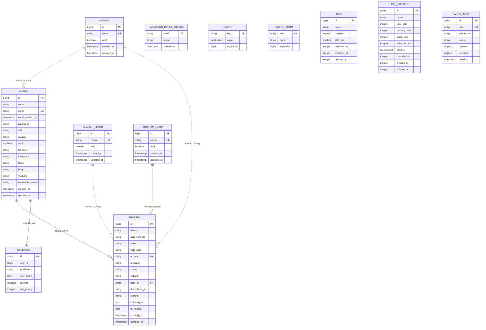

# Dokumentasi Sistem Informasi Leads

Dokumen ini menjelaskan struktur data awal Sistem Informasi Leads berdasarkan migration Laravel yang ada di proyek.

## Ringkasan Sistem

Sistem Informasi Leads digunakan untuk mengelola data leads dari berbagai sumber, cabang, status follow up, closing, profil user, dan akses berdasarkan role.

Role user:

- `superadmin`
- `admin`
- `leader`
- `staff`
- `direksi`

Cabang aktif:

- `Bandung`
- `Jaksel`
- `Jakpus`

Status leads:

- `Baru`
- `Dihubungi`
- `Follow Up`
- `Daftar`
- `Tidak Tertarik`

## ERD

## Kardinalitas

| Relasi | Kardinalitas | Keterangan |
| --- | --- | --- |
| `users` ke `prospek` | 1 ke 0..N | Satu user dapat menjadi penanggung jawab banyak leads. Satu leads boleh belum punya `user_id`. |
| `prospek` ke `users` | 0..N ke 0..1 | Banyak leads dapat mengarah ke satu user. Jika user dihapus, `user_id` pada leads menjadi `null`. |
| `users` ke `sessions` | 1 ke 0..N | Satu user dapat memiliki banyak session login. Kolom `sessions.user_id` nullable dan hanya diindeks. |
| `cabang` ke `users` | 1 ke 0..N secara logis | Relasi berdasarkan teks `cabang.nama = users.cabang`, belum memakai foreign key. |
| `cabang` ke `prospek` | 1 ke 0..N secara logis | Relasi berdasarkan teks `cabang.nama = prospek.cabang`, belum memakai foreign key. |
| `sumber_leads` ke `prospek` | 1 ke 0..N secara logis | Relasi berdasarkan teks `sumber_leads.nama = prospek.sumber`, belum memakai foreign key. |
| `program_leads` ke `prospek` | 1 ke 0..N secara logis | Relasi berdasarkan teks `program_leads.nama = prospek.program`, belum memakai foreign key. |
| `password_reset_tokens` ke `users` | Logis 0..1 ke 1 | Relasi berdasarkan email, tidak dibuat foreign key. |
| `cache`, `cache_locks`, `jobs`, `job_batches`, `failed_jobs` | Mandiri | Tabel bawaan Laravel untuk cache dan queue, tidak menjadi relasi bisnis utama. |

## Tabel Database

### 1. `users`

Menyimpan data akun, role, cabang, status aktif, dan media sosial user.

| Kolom | Tipe | Constraint | Keterangan |
| --- | --- | --- | --- |
| `id` | bigint unsigned | PK, auto increment | ID user |
| `name` | varchar | not null | Nama user |
| `email` | varchar | unique, not null | Email login |
| `email_verified_at` | timestamp | nullable | Waktu verifikasi email |
| `password` | varchar | not null | Password hash |
| `role` | varchar | default `staff` | Role akses |
| `cabang` | varchar | nullable | Cabang user |
| `aktif` | boolean | default `true` | Status akun aktif |
| `facebook` | varchar | nullable | URL Facebook |
| `instagram` | varchar | nullable | URL Instagram |
| `tiktok` | varchar | nullable | URL TikTok |
| `blog` | varchar | nullable | URL blog |
| `youtube` | varchar | nullable | URL channel YouTube |
| `remember_token` | varchar | nullable | Token remember me |
| `created_at` | timestamp | nullable | Waktu dibuat |
| `updated_at` | timestamp | nullable | Waktu diperbarui |

Catatan:

- Role `superadmin` dan `direksi` dapat mengakses semua cabang.
- Role `admin` dan `leader` dibatasi cabang masing-masing.
- Role `staff` dibatasi data dengan `user_id` miliknya.

### 2. `prospek`

Menyimpan data leads.

| Kolom | Tipe | Constraint | Keterangan |
| --- | --- | --- | --- |
| `id` | bigint unsigned | PK, auto increment | ID leads |
| `nama` | varchar | not null | Nama leads |
| `asal_sekolah` | varchar | nullable | Asal sekolah |
| `kelas` | varchar | nullable | Kelas |
| `kota_asal` | varchar | nullable | Kota asal |
| `no_wa` | varchar | nullable, unique | Nomor WhatsApp, digunakan untuk mencegah input ganda |
| `program` | varchar | nullable | Program yang diminati |
| `status` | varchar | default `Baru` | Status leads |
| `cabang` | varchar | nullable | Cabang leads |
| `user_id` | bigint unsigned | nullable, FK ke `users.id`, null on delete | User penanggung jawab atau staff |
| `diserahkan_ke` | varchar | nullable | Admin cabang tujuan |
| `sumber` | varchar | nullable | Sumber leads |
| `keterangan` | text | nullable | Catatan tambahan |
| `tgl_masuk` | date | nullable | Tanggal masuk leads |
| `created_at` | timestamp | nullable | Waktu dibuat |
| `updated_at` | timestamp | nullable | Waktu diperbarui |

Catatan:

- `no_wa` bersifat unique untuk menghindari input leads ganda.
- `status = Daftar` digunakan sebagai data siswa/closing.
- `status = Dihubungi` dan `Follow Up` digunakan pada menu Follow Up dan notifikasi.
- `updated_at` saat ini dipakai sebagai tanggal aktivitas follow up/closing pada beberapa tampilan.

### 3. `cabang`

Master cabang untuk filter, form leads, dan manajemen role user.

| Kolom | Tipe | Constraint | Keterangan |
| --- | --- | --- | --- |
| `id` | bigint unsigned | PK, auto increment | ID cabang |
| `nama` | varchar | unique, not null | Nama cabang |
| `aktif` | boolean | default `true` | Status aktif cabang |
| `created_at` | timestamp | nullable | Waktu dibuat |
| `updated_at` | timestamp | nullable | Waktu diperbarui |

### 4. `sumber_leads`

Master sumber leads untuk form dan filter Data Leads.

| Kolom | Tipe | Constraint | Keterangan |
| --- | --- | --- | --- |
| `id` | bigint unsigned | PK, auto increment | ID sumber |
| `nama` | varchar | unique, not null | Nama sumber leads |
| `aktif` | boolean | default `true` | Status aktif sumber |
| `created_at` | timestamp | nullable | Waktu dibuat |
| `updated_at` | timestamp | nullable | Waktu diperbarui |

### 5. `program_leads`

Master program untuk pilihan program pada input leads.

| Kolom | Tipe | Constraint | Keterangan |
| --- | --- | --- | --- |
| `id` | bigint unsigned | PK, auto increment | ID program |
| `nama` | varchar | unique, not null | Nama program |
| `aktif` | boolean | default `true` | Status aktif program |
| `created_at` | timestamp | nullable | Waktu dibuat |
| `updated_at` | timestamp | nullable | Waktu diperbarui |

### 6. `sessions`

Tabel session Laravel.

| Kolom | Tipe | Constraint | Keterangan |
| --- | --- | --- | --- |
| `id` | varchar | PK | ID session |
| `user_id` | bigint unsigned | nullable, index | User pemilik session |
| `ip_address` | varchar(45) | nullable | IP user |
| `user_agent` | text | nullable | Browser/device |
| `payload` | longtext | not null | Data session |
| `last_activity` | integer | index | Aktivitas terakhir |

### 7. `password_reset_tokens`

Tabel token reset password Laravel.

| Kolom | Tipe | Constraint | Keterangan |
| --- | --- | --- | --- |
| `email` | varchar | PK | Email user |
| `token` | varchar | not null | Token reset |
| `created_at` | timestamp | nullable | Waktu dibuat |

### 8. `cache`

Tabel cache Laravel.

| Kolom | Tipe | Constraint | Keterangan |
| --- | --- | --- | --- |
| `key` | varchar | PK | Key cache |
| `value` | mediumtext | not null | Isi cache |
| `expiration` | bigint | index | Waktu kedaluwarsa |

### 9. `cache_locks`

Tabel lock cache Laravel.

| Kolom | Tipe | Constraint | Keterangan |
| --- | --- | --- | --- |
| `key` | varchar | PK | Key lock |
| `owner` | varchar | not null | Pemilik lock |
| `expiration` | bigint | index | Waktu kedaluwarsa |

### 10. `jobs`

Tabel antrean job Laravel.

| Kolom | Tipe | Constraint | Keterangan |
| --- | --- | --- | --- |
| `id` | bigint unsigned | PK, auto increment | ID job |
| `queue` | varchar | index | Nama queue |
| `payload` | longtext | not null | Payload job |
| `attempts` | unsigned smallint | not null | Jumlah percobaan |
| `reserved_at` | unsigned integer | nullable | Waktu diambil worker |
| `available_at` | unsigned integer | not null | Waktu tersedia |
| `created_at` | unsigned integer | not null | Waktu dibuat |

### 11. `job_batches`

Tabel batch job Laravel.

| Kolom | Tipe | Constraint | Keterangan |
| --- | --- | --- | --- |
| `id` | varchar | PK | ID batch |
| `name` | varchar | not null | Nama batch |
| `total_jobs` | integer | not null | Total job |
| `pending_jobs` | integer | not null | Job tersisa |
| `failed_jobs` | integer | not null | Job gagal |
| `failed_job_ids` | longtext | not null | Daftar ID job gagal |
| `options` | mediumtext | nullable | Opsi batch |
| `cancelled_at` | integer | nullable | Waktu dibatalkan |
| `created_at` | integer | not null | Waktu dibuat |
| `finished_at` | integer | nullable | Waktu selesai |

### 12. `failed_jobs`

Tabel job gagal Laravel.

| Kolom | Tipe | Constraint | Keterangan |
| --- | --- | --- | --- |
| `id` | bigint unsigned | PK, auto increment | ID failed job |
| `uuid` | varchar | unique | UUID job |
| `connection` | varchar | index gabungan | Koneksi queue |
| `queue` | varchar | index gabungan | Nama queue |
| `payload` | longtext | not null | Payload job |
| `exception` | longtext | not null | Detail error |
| `failed_at` | timestamp | default current timestamp, index gabungan | Waktu gagal |

## Data Eksternal

### `database/sekolahVM.json`

File JSON untuk data referensi sekolah pada fitur autosuggest asal sekolah.

Catatan:

- File ini bukan tabel database.
- User tetap dapat mengisi sekolah secara manual jika data tidak ditemukan.

## Catatan Modul Aplikasi

| Modul | Sumber Data Utama | Keterangan |
| --- | --- | --- |
| Dashboard | `prospek`, `users` | Grafik harian, ringkasan leads, sumber, program, cabang, sekolah |
| Data Leads | `prospek` | CRUD leads, import/export, pilih banyak data |
| Follow Up | `prospek` | Leads status `Dihubungi` dan `Follow Up` |
| Data Siswa | `prospek` | Leads status `Daftar` |
| TIM | `users`, `prospek` | Ringkasan anggota aktif dan performa |
| Tugas | `prospek` | Kanban berdasarkan status leads |
| Laporan | `prospek` | Ringkasan report status dan cabang |
| Pembelajaran | data statis view/controller | Modul online course awal |
| Profil User | `users`, `prospek` | Data akun, media sosial, ringkasan personal |
| Pengaturan | `cabang`, `sumber_leads`, `program_leads`, `users` | CRUD master sistem dan manajemen role user |

## Catatan Pengembangan Lanjutan

Beberapa fitur saat ini masih menggunakan data yang sudah ada atau data statis awal:

- Tugas/task management belum memiliki tabel khusus seperti `tasks`.
- Pembelajaran/online course belum memiliki tabel khusus seperti `courses`, `lessons`, atau `course_progress`.
- Follow up belum memiliki tabel histori khusus seperti `follow_ups`; saat ini memakai status leads dan `updated_at`.

Rekomendasi tabel lanjutan:

- `tasks`
- `task_comments`
- `follow_ups`
- `courses`
- `course_lessons`
- `course_progress`
- `notifications`
