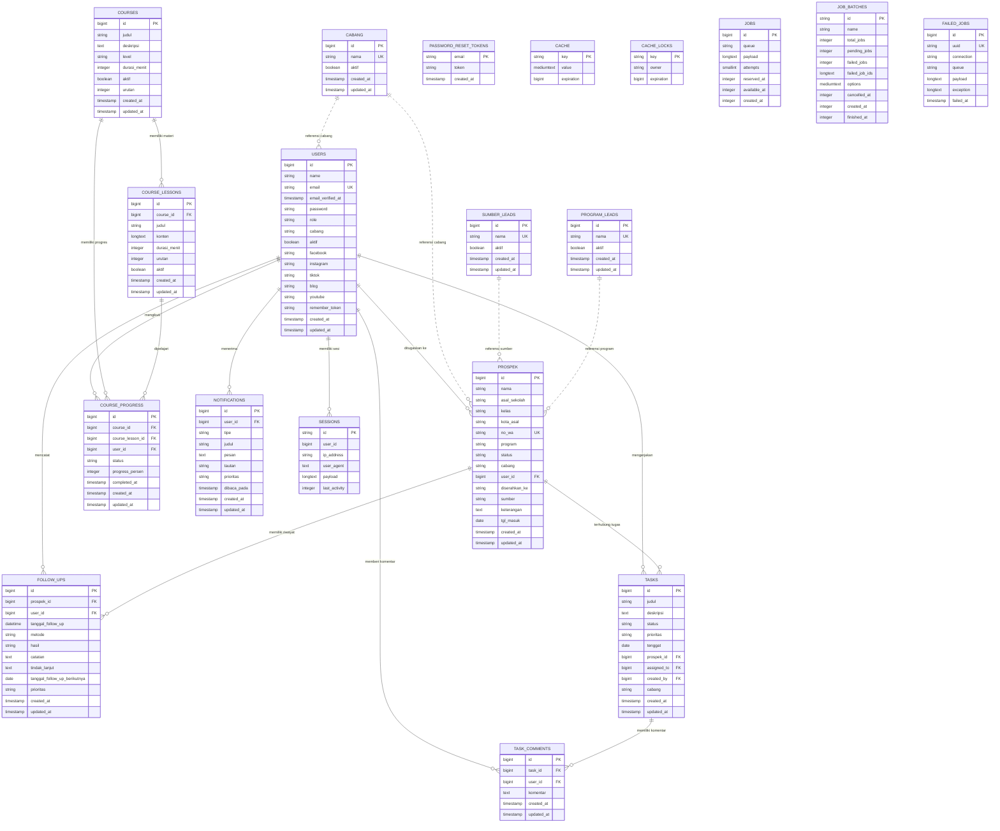

# Dokumentasi Sistem Informasi Leads

Dokumen ini menjelaskan struktur data awal Sistem Informasi Leads berdasarkan migration Laravel yang ada di proyek.

## Ringkasan Sistem

Sistem Informasi Leads digunakan untuk mengelola data leads dari berbagai sumber, cabang, status follow up, closing, profil user, dan akses berdasarkan role.

Role user:

- `superadmin`
- `admin`
- `leader`
- `staff`
- `direksi`

Cabang aktif:

- `Bandung`
- `Jaksel`
- `Jakpus`

Status leads:

- `Baru`
- `Dihubungi`
- `Follow Up`
- `Daftar`
- `Tidak Tertarik`

## ERD

Diagram ERD visual tersedia dalam format Draw.io pada file [`dokumentasi-erd.drawio`](dokumentasi-erd.drawio). File tersebut dapat dibuka melalui diagrams.net/draw.io untuk diedit atau diekspor menjadi PNG/PDF.



## Kardinalitas

| Relasi | Kardinalitas | Keterangan |
| --- | --- | --- |
| `users` ke `prospek` | 1 ke 0..N | Satu user dapat menjadi penanggung jawab banyak leads. Satu leads boleh belum punya `user_id`. |
| `prospek` ke `users` | 0..N ke 0..1 | Banyak leads dapat mengarah ke satu user. Jika user dihapus, `user_id` pada leads menjadi `null`. |
| `prospek` ke `follow_ups` | 1 ke 0..N | Satu leads dapat memiliki banyak aktivitas follow up. Jika leads dihapus, riwayat follow up ikut terhapus. |
| `users` ke `follow_ups` | 1 ke 0..N | Satu user dapat mencatat banyak aktivitas follow up. Jika user dihapus, `user_id` pada follow up menjadi `null`. |
| `users` ke `sessions` | 1 ke 0..N | Satu user dapat memiliki banyak session login. Kolom `sessions.user_id` nullable dan hanya diindeks. |
| `cabang` ke `users` | 1 ke 0..N secara logis | Relasi berdasarkan teks `cabang.nama = users.cabang`, belum memakai foreign key. |
| `cabang` ke `prospek` | 1 ke 0..N secara logis | Relasi berdasarkan teks `cabang.nama = prospek.cabang`, belum memakai foreign key. |
| `sumber_leads` ke `prospek` | 1 ke 0..N secara logis | Relasi berdasarkan teks `sumber_leads.nama = prospek.sumber`, belum memakai foreign key. |
| `program_leads` ke `prospek` | 1 ke 0..N secara logis | Relasi berdasarkan teks `program_leads.nama = prospek.program`, belum memakai foreign key. |
| `password_reset_tokens` ke `users` | Logis 0..1 ke 1 | Relasi berdasarkan email, tidak dibuat foreign key. |
| `cache`, `cache_locks`, `jobs`, `job_batches`, `failed_jobs` | Mandiri | Tabel bawaan Laravel untuk cache dan queue, tidak menjadi relasi bisnis utama. |

## Tabel Database

### 1. `users`

Menyimpan data akun, role, cabang, status aktif, dan media sosial user.

| Kolom | Tipe | Constraint | Keterangan |
| --- | --- | --- | --- |
| `id` | bigint unsigned | PK, auto increment | ID user |
| `name` | varchar | not null | Nama user |
| `email` | varchar | unique, not null | Email login |
| `email_verified_at` | timestamp | nullable | Waktu verifikasi email |
| `password` | varchar | not null | Password hash |
| `role` | varchar | default `staff` | Role akses |
| `cabang` | varchar | nullable | Cabang user |
| `aktif` | boolean | default `true` | Status akun aktif |
| `facebook` | varchar | nullable | URL Facebook |
| `instagram` | varchar | nullable | URL Instagram |
| `tiktok` | varchar | nullable | URL TikTok |
| `blog` | varchar | nullable | URL blog |
| `youtube` | varchar | nullable | URL channel YouTube |
| `remember_token` | varchar | nullable | Token remember me |
| `created_at` | timestamp | nullable | Waktu dibuat |
| `updated_at` | timestamp | nullable | Waktu diperbarui |

Catatan:

- Role `superadmin` dan `direksi` dapat mengakses semua cabang.
- Role `admin` dan `leader` dibatasi cabang masing-masing.
- Role `staff` dibatasi data dengan `user_id` miliknya.

### 2. `prospek`

Menyimpan data leads.

| Kolom | Tipe | Constraint | Keterangan |
| --- | --- | --- | --- |
| `id` | bigint unsigned | PK, auto increment | ID leads |
| `nama` | varchar | not null | Nama leads |
| `asal_sekolah` | varchar | nullable | Asal sekolah |
| `kelas` | varchar | nullable | Kelas |
| `kota_asal` | varchar | nullable | Kota asal |
| `no_wa` | varchar | nullable, unique | Nomor WhatsApp, digunakan untuk mencegah input ganda |
| `program` | varchar | nullable | Program yang diminati |
| `status` | varchar | default `Baru` | Status leads |
| `cabang` | varchar | nullable | Cabang leads |
| `user_id` | bigint unsigned | nullable, FK ke `users.id`, null on delete | User penanggung jawab atau staff |
| `diserahkan_ke` | varchar | nullable | Admin cabang tujuan |
| `sumber` | varchar | nullable | Sumber leads |
| `keterangan` | text | nullable | Catatan tambahan |
| `tgl_masuk` | date | nullable | Tanggal masuk leads |
| `created_at` | timestamp | nullable | Waktu dibuat |
| `updated_at` | timestamp | nullable | Waktu diperbarui |

Catatan:

- `no_wa` bersifat unique untuk menghindari input leads ganda.
- `status = Daftar` digunakan sebagai data siswa/closing.
- `status = Dihubungi` dan `Follow Up` digunakan pada menu Follow Up dan notifikasi.
- `updated_at` saat ini dipakai sebagai tanggal aktivitas follow up/closing pada beberapa tampilan.

### 3. `follow_ups`

Menyimpan riwayat aktivitas follow up per leads.

| Kolom | Tipe | Constraint | Keterangan |
| --- | --- | --- | --- |
| `id` | bigint unsigned | PK, auto increment | ID aktivitas follow up |
| `prospek_id` | bigint unsigned | FK ke `prospek.id`, cascade on delete | Leads yang di-follow up |
| `user_id` | bigint unsigned | nullable, FK ke `users.id`, null on delete | User yang mencatat follow up |
| `tanggal_follow_up` | datetime | not null, index gabungan | Tanggal dan waktu follow up dilakukan |
| `metode` | varchar | default `WhatsApp` | Metode follow up |
| `hasil` | varchar | default `Tersambung`, index gabungan | Hasil follow up |
| `catatan` | text | nullable | Catatan percakapan |
| `tindak_lanjut` | text | nullable | Tindak lanjut setelah follow up |
| `tanggal_follow_up_berikutnya` | date | nullable, index | Jadwal follow up berikutnya |
| `prioritas` | varchar | default `Normal` | Prioritas follow up |
| `created_at` | timestamp | nullable | Waktu dibuat |
| `updated_at` | timestamp | nullable | Waktu diperbarui |

Catatan:

- Jumlah follow up per leads dihitung dari banyaknya baris `follow_ups` berdasarkan `prospek_id`.
- Hasil `Closing` memperbarui status leads menjadi `Daftar`.
- Hasil `Tidak tertarik` dan `Nomor tidak aktif` memperbarui status leads menjadi `Tidak Tertarik`.
- Hasil lain memperbarui status leads menjadi `Dihubungi` atau `Follow Up`.

### 4. `cabang`

Master cabang untuk filter, form leads, dan manajemen role user.

| Kolom | Tipe | Constraint | Keterangan |
| --- | --- | --- | --- |
| `id` | bigint unsigned | PK, auto increment | ID cabang |
| `nama` | varchar | unique, not null | Nama cabang |
| `aktif` | boolean | default `true` | Status aktif cabang |
| `created_at` | timestamp | nullable | Waktu dibuat |
| `updated_at` | timestamp | nullable | Waktu diperbarui |

### 5. `tasks`

Menyimpan task management internal yang dapat dihubungkan ke leads.

| Kolom | Tipe | Constraint | Keterangan |
| --- | --- | --- | --- |
| `id` | bigint unsigned | PK, auto increment | ID tugas |
| `judul` | varchar | not null | Judul tugas |
| `deskripsi` | text | nullable | Detail tugas |
| `status` | varchar | default `Baru`, index gabungan | Status tugas: `Baru`, `Proses`, `Selesai`, `Arsip` |
| `prioritas` | varchar | default `Normal`, index gabungan | Prioritas tugas |
| `tenggat` | date | nullable, index | Batas waktu tugas |
| `prospek_id` | bigint unsigned | nullable, FK ke `prospek.id`, null on delete | Leads terkait |
| `assigned_to` | bigint unsigned | nullable, FK ke `users.id`, null on delete | User penerima tugas |
| `created_by` | bigint unsigned | nullable, FK ke `users.id`, null on delete | User pembuat tugas |
| `cabang` | varchar | nullable | Cabang tugas |
| `created_at` | timestamp | nullable | Waktu dibuat |
| `updated_at` | timestamp | nullable | Waktu diperbarui |

### 6. `task_comments`

Menyimpan komentar atau update percakapan pada tugas.

| Kolom | Tipe | Constraint | Keterangan |
| --- | --- | --- | --- |
| `id` | bigint unsigned | PK, auto increment | ID komentar |
| `task_id` | bigint unsigned | FK ke `tasks.id`, cascade on delete | Tugas terkait |
| `user_id` | bigint unsigned | nullable, FK ke `users.id`, null on delete | User penulis komentar |
| `komentar` | text | not null | Isi komentar |
| `created_at` | timestamp | nullable | Waktu dibuat |
| `updated_at` | timestamp | nullable | Waktu diperbarui |

### 7. `courses`

Menyimpan data course/pembelajaran online.

| Kolom | Tipe | Constraint | Keterangan |
| --- | --- | --- | --- |
| `id` | bigint unsigned | PK, auto increment | ID course |
| `judul` | varchar | not null | Judul course |
| `deskripsi` | text | nullable | Deskripsi course |
| `level` | varchar | default `Umum` | Kategori/level course |
| `durasi_menit` | integer unsigned | default `0` | Estimasi durasi |
| `aktif` | boolean | default `true` | Status course aktif |
| `urutan` | integer unsigned | default `0` | Urutan tampil |
| `created_at` | timestamp | nullable | Waktu dibuat |
| `updated_at` | timestamp | nullable | Waktu diperbarui |

### 8. `course_lessons`

Menyimpan materi di dalam course.

| Kolom | Tipe | Constraint | Keterangan |
| --- | --- | --- | --- |
| `id` | bigint unsigned | PK, auto increment | ID lesson |
| `course_id` | bigint unsigned | FK ke `courses.id`, cascade on delete | Course induk |
| `judul` | varchar | not null | Judul materi |
| `konten` | longtext | nullable | Isi materi |
| `durasi_menit` | integer unsigned | default `0` | Estimasi durasi materi |
| `urutan` | integer unsigned | default `0` | Urutan materi |
| `aktif` | boolean | default `true` | Status materi aktif |
| `created_at` | timestamp | nullable | Waktu dibuat |
| `updated_at` | timestamp | nullable | Waktu diperbarui |

### 9. `course_progress`

Menyimpan progres pembelajaran user.

| Kolom | Tipe | Constraint | Keterangan |
| --- | --- | --- | --- |
| `id` | bigint unsigned | PK, auto increment | ID progres |
| `course_id` | bigint unsigned | FK ke `courses.id`, cascade on delete | Course terkait |
| `course_lesson_id` | bigint unsigned | nullable, FK ke `course_lessons.id`, cascade on delete | Materi terkait |
| `user_id` | bigint unsigned | FK ke `users.id`, cascade on delete | User peserta |
| `status` | varchar | default `Belum Mulai` | Status progres |
| `progress_persen` | tinyint unsigned | default `0` | Persentase progres |
| `completed_at` | timestamp | nullable | Waktu selesai |
| `created_at` | timestamp | nullable | Waktu dibuat |
| `updated_at` | timestamp | nullable | Waktu diperbarui |

### 10. `notifications`

Menyimpan notifikasi sistem untuk user atau broadcast umum.

| Kolom | Tipe | Constraint | Keterangan |
| --- | --- | --- | --- |
| `id` | bigint unsigned | PK, auto increment | ID notifikasi |
| `user_id` | bigint unsigned | nullable, FK ke `users.id`, cascade on delete | User penerima, `null` untuk broadcast |
| `tipe` | varchar | default `info` | Tipe notifikasi |
| `judul` | varchar | not null | Judul notifikasi |
| `pesan` | text | nullable | Isi notifikasi |
| `tautan` | varchar | nullable | Link tujuan |
| `prioritas` | varchar | default `Normal` | Prioritas notifikasi |
| `dibaca_pada` | timestamp | nullable, index gabungan | Waktu dibaca |
| `created_at` | timestamp | nullable | Waktu dibuat |
| `updated_at` | timestamp | nullable | Waktu diperbarui |

### 11. `sumber_leads`

Master sumber leads untuk form dan filter Data Leads.

| Kolom | Tipe | Constraint | Keterangan |
| --- | --- | --- | --- |
| `id` | bigint unsigned | PK, auto increment | ID sumber |
| `nama` | varchar | unique, not null | Nama sumber leads |
| `aktif` | boolean | default `true` | Status aktif sumber |
| `created_at` | timestamp | nullable | Waktu dibuat |
| `updated_at` | timestamp | nullable | Waktu diperbarui |

### 12. `program_leads`

Master program untuk pilihan program pada input leads.

| Kolom | Tipe | Constraint | Keterangan |
| --- | --- | --- | --- |
| `id` | bigint unsigned | PK, auto increment | ID program |
| `nama` | varchar | unique, not null | Nama program |
| `aktif` | boolean | default `true` | Status aktif program |
| `created_at` | timestamp | nullable | Waktu dibuat |
| `updated_at` | timestamp | nullable | Waktu diperbarui |

### 13. `sessions`

Tabel session Laravel.

| Kolom | Tipe | Constraint | Keterangan |
| --- | --- | --- | --- |
| `id` | varchar | PK | ID session |
| `user_id` | bigint unsigned | nullable, index | User pemilik session |
| `ip_address` | varchar(45) | nullable | IP user |
| `user_agent` | text | nullable | Browser/device |
| `payload` | longtext | not null | Data session |
| `last_activity` | integer | index | Aktivitas terakhir |

### 14. `password_reset_tokens`

Tabel token reset password Laravel.

| Kolom | Tipe | Constraint | Keterangan |
| --- | --- | --- | --- |
| `email` | varchar | PK | Email user |
| `token` | varchar | not null | Token reset |
| `created_at` | timestamp | nullable | Waktu dibuat |

### 15. `cache`

Tabel cache Laravel.

| Kolom | Tipe | Constraint | Keterangan |
| --- | --- | --- | --- |
| `key` | varchar | PK | Key cache |
| `value` | mediumtext | not null | Isi cache |
| `expiration` | bigint | index | Waktu kedaluwarsa |

### 16. `cache_locks`

Tabel lock cache Laravel.

| Kolom | Tipe | Constraint | Keterangan |
| --- | --- | --- | --- |
| `key` | varchar | PK | Key lock |
| `owner` | varchar | not null | Pemilik lock |
| `expiration` | bigint | index | Waktu kedaluwarsa |

### 17. `jobs`

Tabel antrean job Laravel.

| Kolom | Tipe | Constraint | Keterangan |
| --- | --- | --- | --- |
| `id` | bigint unsigned | PK, auto increment | ID job |
| `queue` | varchar | index | Nama queue |
| `payload` | longtext | not null | Payload job |
| `attempts` | unsigned smallint | not null | Jumlah percobaan |
| `reserved_at` | unsigned integer | nullable | Waktu diambil worker |
| `available_at` | unsigned integer | not null | Waktu tersedia |
| `created_at` | unsigned integer | not null | Waktu dibuat |

### 18. `job_batches`

Tabel batch job Laravel.

| Kolom | Tipe | Constraint | Keterangan |
| --- | --- | --- | --- |
| `id` | varchar | PK | ID batch |
| `name` | varchar | not null | Nama batch |
| `total_jobs` | integer | not null | Total job |
| `pending_jobs` | integer | not null | Job tersisa |
| `failed_jobs` | integer | not null | Job gagal |
| `failed_job_ids` | longtext | not null | Daftar ID job gagal |
| `options` | mediumtext | nullable | Opsi batch |
| `cancelled_at` | integer | nullable | Waktu dibatalkan |
| `created_at` | integer | not null | Waktu dibuat |
| `finished_at` | integer | nullable | Waktu selesai |

### 19. `failed_jobs`

Tabel job gagal Laravel.

| Kolom | Tipe | Constraint | Keterangan |
| --- | --- | --- | --- |
| `id` | bigint unsigned | PK, auto increment | ID failed job |
| `uuid` | varchar | unique | UUID job |
| `connection` | varchar | index gabungan | Koneksi queue |
| `queue` | varchar | index gabungan | Nama queue |
| `payload` | longtext | not null | Payload job |
| `exception` | longtext | not null | Detail error |
| `failed_at` | timestamp | default current timestamp, index gabungan | Waktu gagal |

## Data Eksternal

### `database/sekolahVM.json`

File JSON untuk data referensi sekolah pada fitur autosuggest asal sekolah.

Catatan:

- File ini bukan tabel database.
- User tetap dapat mengisi sekolah secara manual jika data tidak ditemukan.

## Catatan Modul Aplikasi

| Modul | Sumber Data Utama | Keterangan |
| --- | --- | --- |
| Dashboard | `prospek`, `users` | Grafik harian, ringkasan leads, sumber, program, cabang, sekolah |
| Data Leads | `prospek` | CRUD leads, import/export, pilih banyak data |
| Follow Up | `prospek`, `follow_ups` | Riwayat aktivitas follow up, jumlah follow up per leads, kalender, hasil follow up |
| Data Siswa | `prospek` | Leads status `Daftar` |
| TIM | `users`, `prospek` | Ringkasan anggota aktif dan performa |
| Tugas | `tasks`, `task_comments`, `prospek`, `users` | Kanban task management, tugas terkait leads, komentar tugas |
| Laporan | `prospek` | Ringkasan report status dan cabang |
| Pembelajaran | `courses`, `course_lessons`, `course_progress` | Modul online course dan progres pembelajaran user |
| Profil User | `users`, `prospek` | Data akun, media sosial, ringkasan personal |
| Pengaturan | `cabang`, `sumber_leads`, `program_leads`, `users` | CRUD master sistem dan manajemen role user |
| Notifikasi | `notifications` | Badge notifikasi user dan broadcast sistem |

## Enterprise Architecture

Enterprise Architecture Sistem Informasi Leads dibagi menjadi empat sudut pandang utama: arsitektur proses, arsitektur data, arsitektur aplikasi, dan arsitektur teknologi.

### 1. Arsitektur Proses

Arsitektur proses menjelaskan alur kerja bisnis utama dalam sistem.

| Proses | Aktor | Input | Output | Modul |
| --- | --- | --- | --- | --- |
| Login dan autentikasi | Semua role | Email, password | Session user aktif | Login |
| Input leads | Superadmin, admin, leader, staff | Nama, sekolah, WA, program, cabang, sumber, tanggal masuk | Data leads baru | Data Leads, Tambah Leads |
| Validasi input ganda | Sistem | Nomor WhatsApp | Penolakan jika `no_wa` sudah ada | Data Leads |
| Import leads | Superadmin, admin, leader, staff | File CSV contoh import | Banyak data leads masuk sekaligus | Data Leads |
| Export leads | User sesuai akses | Filter/status/cabang/data terpilih | File export leads | Data Leads |
| Distribusi leads ke cabang | Superadmin, admin, leader | Cabang tujuan, admin tujuan | Leads memiliki cabang dan tujuan penyerahan | Data Leads |
| Follow up leads | Admin, leader, staff | Perubahan status dan catatan | Leads masuk daftar follow up | Follow Up |
| Closing/data siswa | Admin, leader, staff | Status `Daftar` | Data siswa/closing | Data Siswa |
| Monitoring performa | Superadmin, admin, leader, direksi | Filter bulan, tahun, cabang, admin, staff | Dashboard grafik dan ringkasan | Dashboard |
| Manajemen master | Superadmin | Cabang, sumber leads, program leads | Data master aktif/nonaktif | Pengaturan |
| Manajemen role user | Superadmin | Role, cabang, status aktif | Hak akses user diperbarui | Pengaturan |
| Profil dan aktivitas user | Semua role | Data profil, media sosial | Profil user dan ringkasan personal | Profil User |

Ringkasan alur proses utama:

1. User login sesuai role.
2. User menginput atau mengimport leads.
3. Sistem mengecek duplikasi berdasarkan nomor WhatsApp.
4. Leads diberi cabang, sumber, program, status, dan penanggung jawab.
5. Leads dipantau melalui dashboard harian dan grafik per sumber/program/cabang/sekolah.
6. Leads yang perlu dihubungi masuk ke Follow Up.
7. Leads dengan status `Daftar` masuk ke Data Siswa/closing.
8. Superadmin mengelola data master dan role user melalui Pengaturan.

### 2. Arsitektur Data

Arsitektur data menjelaskan struktur data, sumber data, dan relasi logis yang digunakan aplikasi.

| Kelompok Data | Entitas | Fungsi |
| --- | --- | --- |
| Data identitas dan akses | `users` | Akun login, role, cabang, status aktif, media sosial |
| Data transaksi utama | `prospek`, `follow_ups` | Data leads, riwayat follow up, status closing, sumber, program, cabang |
| Data master | `cabang`, `sumber_leads`, `program_leads` | Referensi pilihan form, filter, dan manajemen sistem |
| Data session | `sessions` | Penyimpanan session login |
| Data cache | `cache`, `cache_locks` | Penyimpanan cache Laravel |
| Data queue | `jobs`, `job_batches`, `failed_jobs` | Antrean job Laravel bila digunakan |
| Data reset akses | `password_reset_tokens` | Token reset password bawaan Laravel |
| Data eksternal | `database/sekolahVM.json` | Referensi autosuggest asal sekolah |

Prinsip arsitektur data:

- `prospek.no_wa` dibuat unique untuk menghindari input leads ganda.
- Relasi `prospek.user_id` memakai foreign key ke `users.id` dan menjadi `null` jika user dihapus.
- Relasi cabang, sumber, dan program saat ini masih berbasis teks, yaitu mencocokkan `nama` master dengan kolom di `users` dan `prospek`.
- Data sekolah tidak disimpan sebagai tabel, tetapi sebagai JSON referensi untuk autosuggest. User tetap dapat mengisi manual bila data sekolah tidak ditemukan.
- Data dashboard dihitung dari `prospek` berdasarkan `tgl_masuk`, `status`, `cabang`, `program`, `sumber`, dan `asal_sekolah`.
- Data aktivitas follow up dihitung dari `follow_ups` berdasarkan `prospek_id`, `tanggal_follow_up`, `hasil`, dan `tanggal_follow_up_berikutnya`.

### 3. Arsitektur Aplikasi

Arsitektur aplikasi menjelaskan pembagian modul dan komponen aplikasi Laravel.

| Lapisan | Komponen | Keterangan |
| --- | --- | --- |
| Presentation | Blade view di `resources/views` | Tampilan dashboard, leads, follow up, profil, pengaturan, dan login |
| Styling dan interaksi | `resources/css/app.css`, `resources/js/app.js` | Layout responsif, sidebar collapsible, autosuggest sekolah, multi-select leads, modal konfirmasi |
| Routing | `routes/web.php` | Definisi URL, middleware auth, dan akses role |
| Controller | `app/Http/Controllers` | Logika dashboard, CRUD leads, profil, pengaturan, modul user |
| Model | `app/Models` | Representasi tabel `User`, `Prospek`, `Cabang`, `SumberLead`, `ProgramLead` |
| Middleware | `app/Http/Middleware/PastikanRole.php` | Pembatasan akses berdasarkan role |
| Database migration | `database/migrations` | Struktur tabel database |
| Seeder | `database/seeders/DatabaseSeeder.php` | Data awal akun, cabang, sumber, dan program |
| Data referensi | `database/sekolahVM.json` | Referensi sekolah untuk autosuggest |

Pembagian modul aplikasi:

| Modul | Route Utama | Controller | Fungsi |
| --- | --- | --- | --- |
| Login | `/login` | `AuthController` | Autentikasi user |
| Dashboard | `/dashboard` | `ProspekController` | Ringkasan, grafik harian, visual sumber/program/cabang/sekolah |
| Data Leads | `/prospek` | `ProspekController` | CRUD, import, export, pilih banyak data |
| Follow Up | `/follow-up` | `ProspekController` | Catat aktivitas follow up, kalender, jumlah follow up per leads, timeline hasil |
| Data Siswa | `/data-siswa` | `ProspekController` | Leads status `Daftar` |
| Profil User | `/profil` | `ProfilController`, `ModulController` | Profil, media sosial, TIM, Tugas, Laporan, Pembelajaran |
| Tugas | `/profil/tugas` | `ModulController` | Kanban task management berdasarkan tabel `tasks` |
| Pembelajaran | `/profil/pembelajaran` | `ModulController` | Daftar course dan progress user |
| Pengaturan | `/pengaturan` | `PengaturanController` | CRUD cabang, sumber, program, dan role user |

### 4. Arsitektur Teknologi

Arsitektur teknologi menjelaskan platform, runtime, deployment, dan dependency teknis.

| Komponen | Teknologi | Keterangan |
| --- | --- | --- |
| Framework backend | Laravel `^13.8` | Framework utama aplikasi |
| Bahasa backend | PHP `^8.3` | Runtime server |
| Template | Blade | Server-side rendering |
| Frontend build | Vite | Build CSS dan JavaScript |
| Styling | CSS custom + Tailwind import | Layout, komponen, responsive design |
| JavaScript | Vanilla JS | Sidebar, autocomplete, multi-select, modal konfirmasi |
| Database production | MySQL | Database hosting production |
| Database lokal | SQLite/MySQL sesuai `.env` | Pengembangan lokal |
| Package manager PHP | Composer | Dependency Laravel |
| Package manager frontend | npm | Build asset lokal |
| Web server | Apache/LiteSpeed hosting | Menggunakan `.htaccess` untuk rewrite ke `public` |
| Version control | Git/GitHub | Repository `inifauzan-maker/lead.git` |
| Deployment | hPanel/Hostinger subdomain | Root Laravel di `public_html`, akses web diarahkan ke `public` |

Catatan deployment shared hosting:

- Jika document root bisa diatur, arahkan subdomain ke folder `public`.
- Jika document root tidak bisa diarahkan ke `public`, gunakan `.htaccess` root untuk rewrite ke folder `public`.
- Karena hosting tidak selalu menyediakan `npm`, folder `public/build` perlu ikut tersedia di server.
- Jalankan `php artisan migrate --force` dan `php artisan db:seed --force` untuk menyiapkan tabel dan akun awal.
- Pastikan `storage` dan `bootstrap/cache` writable.

## Backup dan Restore Database

Backup data penting tersedia dari menu **Pengaturan > Backup dan Restore Data > Export Backup SQL**.

File backup yang dihasilkan berbentuk `.sql` dan berisi data penting aplikasi:

- `cabang`
- `sumber_leads`
- `program_leads`
- `users`
- `prospek`
- `follow_ups`
- `tasks`
- `task_comments`
- `courses`
- `course_lessons`
- `course_progress`
- `notifications`
- `activity_logs`

File backup tidak menyertakan data sementara seperti `cache`, `sessions`, `jobs`, `failed_jobs`, `password_reset_tokens`, dan file referensi `database/sekolahVM.json`.

### Cara Membuat Backup

1. Login sebagai `superadmin`.
2. Buka menu **Pengaturan**.
3. Pada panel **Backup dan Restore Data**, klik **Export Backup SQL**.
4. Simpan file `.sql` di lokasi aman.

Catatan keamanan:

- File backup berisi data user, hash password, nomor WhatsApp leads, riwayat follow up, dan log aktivitas.
- Jangan membagikan file backup melalui kanal publik.
- Simpan backup berkala sebelum deploy, migrasi database, atau perubahan besar.

### Cara Restore via phpMyAdmin

Gunakan cara ini untuk shared hosting seperti hPanel/Hostinger.

1. Aktifkan mode maintenance jika aplikasi sudah dipakai:

```bash
php artisan down
```

2. Backup database aktif terlebih dahulu dari phpMyAdmin agar ada titik balik.
3. Pastikan struktur tabel sudah sesuai versi aplikasi:

```bash
php artisan migrate --force
```

4. Buka phpMyAdmin, pilih database aplikasi.
5. Masuk tab **Import**.
6. Pilih file backup `.sql` hasil export dari aplikasi.
7. Jalankan import.
8. Setelah selesai, bersihkan cache Laravel:

```bash
php artisan config:clear
php artisan cache:clear
php artisan view:clear
```

9. Matikan mode maintenance:

```bash
php artisan up
```

### Cara Restore via Terminal MySQL

Gunakan cara ini jika server menyediakan akses SSH dan perintah `mysql`.

```bash
cd ~/domains/lead.sivmi.id/public_html
php artisan down
php artisan migrate --force
mysql -u DB_USERNAME -p DB_DATABASE < backup-crm-sivmi-YYYYMMDD-HHMMSS.sql
php artisan config:clear
php artisan cache:clear
php artisan view:clear
php artisan up
```

Ganti:

- `DB_USERNAME` dengan username database dari `.env`.
- `DB_DATABASE` dengan nama database dari `.env`.
- `backup-crm-sivmi-YYYYMMDD-HHMMSS.sql` dengan nama file backup yang akan direstore.

### Catatan Restore Penting

- Restore akan mengosongkan lalu mengisi ulang tabel penting yang tercantum dalam file backup.
- Jangan restore ke database produksi tanpa backup database aktif terlebih dahulu.
- Pastikan file backup berasal dari versi aplikasi yang sama atau kompatibel dengan migration terbaru.
- Jika restore dilakukan di server baru, upload juga file aplikasi, jalankan `composer install` jika diperlukan, set `.env`, generate `APP_KEY` bila belum ada, lalu jalankan migration sebelum import backup.

## Catatan Pengembangan Lanjutan

Fitur lanjutan yang sudah memiliki fondasi tabel:

- `tasks`
- `task_comments`
- `courses`
- `course_lessons`
- `course_progress`
- `notifications`

Rekomendasi pengembangan berikutnya:

- Detail task khusus untuk riwayat komentar penuh, lampiran, dan aktivitas perubahan status.
- CRUD course dan lesson untuk superadmin dari menu Pengaturan.
- Progress lesson per materi, bukan hanya progress keseluruhan course.
- Notifikasi otomatis untuk follow up terlambat, tugas jatuh tempo, dan course wajib.
- Scheduler/queue untuk mengirim reminder notifikasi harian.
