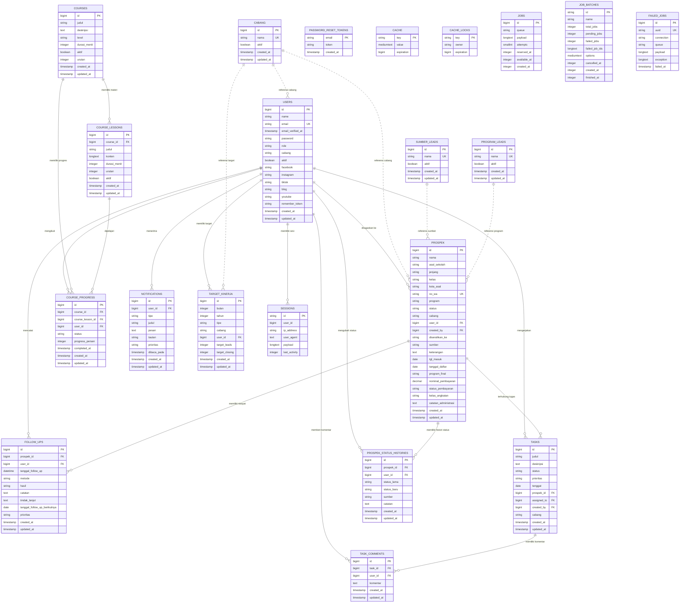
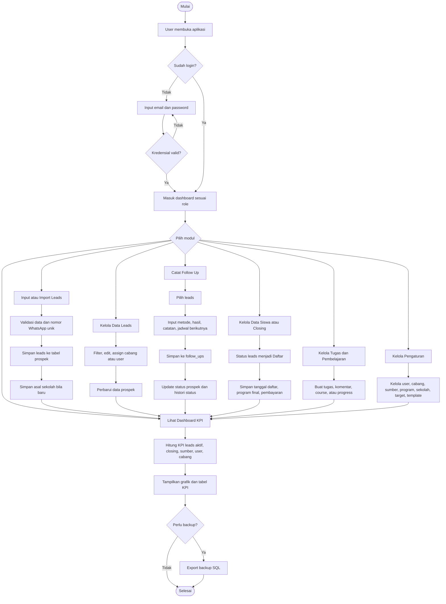
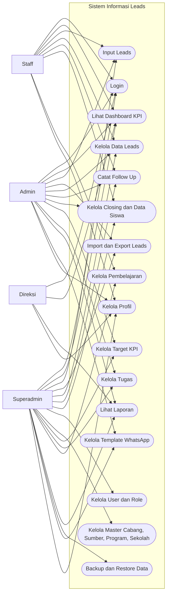
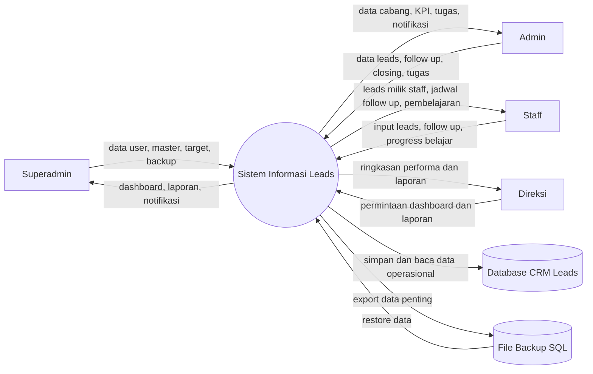

# Dokumentasi Sistem Informasi Leads

Dokumen ini menjelaskan struktur data awal Sistem Informasi Leads berdasarkan migration Laravel yang ada di proyek.

## Ringkasan Sistem

Sistem Informasi Leads digunakan untuk mengelola data leads dari berbagai sumber, cabang, status follow up, closing, profil user, dan akses berdasarkan role.

Role user:

- `superadmin`
- `admin`
- `staff`
- `direksi`

Cabang aktif:

- `Bandung`
- `Jaksel`
- `Jakpus`

Status leads:

- `Baru`
- `Dihubungi`
- `Follow Up`
- `Daftar`
- `Tidak Tertarik`

## ERD

Diagram ERD visual tersedia dalam format Draw.io pada file [`dokumentasi-erd.drawio`](dokumentasi-erd.drawio). File tersebut dapat dibuka melalui diagrams.net/draw.io untuk diedit atau diekspor menjadi PNG/PDF.



## Diagram Flow

Diagram flow berikut menjelaskan alur utama dari login sampai monitoring dashboard dan backup data.



## Diagram Use Case

Diagram use case berikut menggambarkan hak akses utama berdasarkan role.



## DFD

DFD level konteks menggambarkan batas sistem dan arus data antara aktor dengan aplikasi.



DFD level 1 merinci proses internal utama dan data store yang digunakan.

```mermaid
flowchart TD
    A1[User Aplikasi]

    P1((1. Autentikasi dan Role))
    P2((2. Kelola Leads))
    P3((3. Follow Up dan Closing))
    P4((4. Dashboard dan Laporan))
    P5((5. Pengaturan Master))
    P6((6. Tugas dan Pembelajaran))
    P7((7. Backup dan Restore))

    D1[(users)]
    D2[(prospek)]
    D3[(follow_ups)]
    D4[(prospek_status_histories)]
    D5[(cabang, sumber_leads, program_leads, sekolah)]
    D6[(tasks, task_comments)]
    D7[(courses, course_lessons, course_progress)]
    D8[(notifications)]
    D9[(target_kinerja)]
    D10[(activity_logs)]
    D11[(backup SQL)]

    A1 -- email dan password --> P1
    P1 -- validasi akun dan role --> D1
    P1 -- sesi dan hak akses --> A1
    P1 -- catat login --> D10

    A1 -- input, import, edit, assign leads --> P2
    P2 -- simpan dan ambil leads --> D2
    P2 -- referensi cabang, sumber, program, sekolah --> D5
    P2 -- notifikasi perubahan data --> D8
    P2 -- log aktivitas --> D10

    A1 -- hasil follow up dan data closing --> P3
    P3 -- baca dan update status leads --> D2
    P3 -- simpan riwayat follow up --> D3
    P3 -- simpan histori status --> D4
    P3 -- notifikasi follow up --> D8
    P3 -- log aktivitas --> D10

    A1 -- permintaan KPI dan laporan --> P4
    P4 -- agregasi leads dan closing --> D2
    P4 -- agregasi follow up --> D3
    P4 -- target KPI --> D9
    P4 -- hasil dashboard dan laporan --> A1

    A1 -- kelola master, user, target, template --> P5
    P5 -- CRUD user dan role --> D1
    P5 -- CRUD master --> D5
    P5 -- CRUD target --> D9
    P5 -- log pengaturan --> D10

    A1 -- buat tugas, komentar, akses course --> P6
    P6 -- data tugas --> D6
    P6 -- data pembelajaran --> D7
    P6 -- notifikasi tugas --> D8
    P6 -- log aktivitas --> D10

    A1 -- export atau restore data --> P7
    P7 -- baca dan tulis data penting --> D1
    P7 -- baca dan tulis leads --> D2
    P7 -- baca dan tulis modul pendukung --> D3
    P7 -- file backup --> D11
```



## Kardinalitas

| Relasi | Kardinalitas | Keterangan |
| --- | --- | --- |
| `users.id` ke `prospek.user_id` | 1 ke 0..N | Satu user dapat menjadi penanggung jawab banyak leads. Satu leads boleh belum punya `user_id`. Jika user dihapus, `user_id` menjadi `null`. |
| `users.id` ke `prospek.created_by` | 1 ke 0..N | Satu user dapat menjadi sumber input/import banyak leads. Jika user dihapus, `created_by` menjadi `null`. |
| `prospek` ke `follow_ups` | 1 ke 0..N | Satu leads dapat memiliki banyak aktivitas follow up. Jika leads dihapus, riwayat follow up ikut terhapus. |
| `users` ke `follow_ups` | 1 ke 0..N | Satu user dapat mencatat banyak aktivitas follow up. Jika user dihapus, `user_id` pada follow up menjadi `null`. |
| `prospek` ke `prospek_status_histories` | 1 ke 0..N | Satu leads dapat memiliki banyak riwayat perubahan status. Jika leads dihapus, riwayat status ikut terhapus. |
| `users` ke `prospek_status_histories` | 1 ke 0..N | Satu user dapat mencatat banyak perubahan status. Jika user dihapus, `user_id` riwayat menjadi `null`. |
| `prospek` ke `tasks` | 1 ke 0..N | Satu leads dapat terkait banyak tugas. Kolom `tasks.prospek_id` nullable dan menjadi `null` jika leads dihapus. |
| `users.id` ke `tasks.assigned_to` | 1 ke 0..N | Satu user admin dapat menerima banyak tugas. Jika user dihapus, `assigned_to` menjadi `null`. |
| `users.id` ke `tasks.created_by` | 1 ke 0..N | Satu user admin dapat membuat banyak tugas. Jika user dihapus, `created_by` menjadi `null`. |
| `tasks` ke `task_comments` | 1 ke 0..N | Satu tugas dapat memiliki banyak komentar. Jika tugas dihapus, komentar ikut terhapus. |
| `users` ke `task_comments` | 1 ke 0..N | Satu user dapat menulis banyak komentar tugas. Jika user dihapus, `user_id` komentar menjadi `null`. |
| `courses` ke `course_lessons` | 1 ke 0..N | Satu course memiliki banyak materi. Jika course dihapus, materi ikut terhapus. |
| `courses` ke `course_progress` | 1 ke 0..N | Satu course dapat memiliki banyak progres user. Jika course dihapus, progres ikut terhapus. |
| `course_lessons` ke `course_progress` | 1 ke 0..N | Satu materi dapat muncul di banyak progres user. Kolom `course_lesson_id` nullable, tetapi ikut terhapus jika materi dihapus. |
| `users` ke `course_progress` | 1 ke 0..N | Satu user dapat memiliki banyak progres course. Jika user dihapus, progres ikut terhapus. |
| `users` ke `notifications` | 1 ke 0..N | Satu user dapat menerima banyak notifikasi. `notifications.user_id` nullable untuk broadcast umum. |
| `users` ke `target_kinerja` | 1 ke 0..N | Satu user dapat memiliki banyak target bulanan/tahunan. Target cabang boleh tidak memiliki `user_id`. |
| `users` ke `activity_logs` | 1 ke 0..N | Satu user dapat memiliki banyak log aktivitas. Jika user dihapus, `user_id` log menjadi `null`. |
| `users` ke `sekolah` | 1 ke 0..N | Satu user dapat menambahkan banyak master sekolah. Jika user dihapus, `created_by` menjadi `null`. |
| `users` ke `sessions` | 1 ke 0..N | Satu user dapat memiliki banyak session login. Kolom `sessions.user_id` nullable dan hanya diindeks. |
| `cabang` ke `users` | 1 ke 0..N secara logis | Relasi berdasarkan teks `cabang.nama = users.cabang`, belum memakai foreign key. |
| `cabang` ke `prospek` | 1 ke 0..N secara logis | Relasi berdasarkan teks `cabang.nama = prospek.cabang`, belum memakai foreign key. |
| `sumber_leads` ke `prospek` | 1 ke 0..N secara logis | Relasi berdasarkan teks `sumber_leads.nama = prospek.sumber`, belum memakai foreign key. |
| `program_leads` ke `prospek` | 1 ke 0..N secara logis | Relasi berdasarkan teks `program_leads.nama = prospek.program`, belum memakai foreign key. |
| `password_reset_tokens` ke `users` | Logis 0..1 ke 1 | Relasi berdasarkan email, tidak dibuat foreign key. |
| `whatsapp_templates`, `cache`, `cache_locks`, `jobs`, `job_batches`, `failed_jobs` | Mandiri | Tabel pendukung yang tidak menjadi relasi bisnis utama. |

## Tabel Database

Ringkasan tabel fisik yang dipakai aplikasi:

| No | Tabel | Fungsi | Kunci/Relasi Utama |
| --- | --- | --- | --- |
| 1 | `users` | Akun, role, cabang, status aktif user | PK `id`; direferensikan oleh leads, follow up, tugas, course progress, notifikasi, target, log |
| 2 | `prospek` | Data utama leads dan data siswa/closing | PK `id`; FK `user_id`, `created_by`; relasi logis ke cabang, sumber, program |
| 3 | `follow_ups` | Riwayat follow up leads | FK `prospek_id`, `user_id` |
| 4 | `prospek_status_histories` | Riwayat perubahan status leads | FK `prospek_id`, `user_id` |
| 5 | `cabang` | Master cabang | PK `id`; relasi logis lewat kolom teks `cabang` |
| 6 | `sumber_leads` | Master sumber leads | PK `id`; relasi logis lewat `prospek.sumber` |
| 7 | `program_leads` | Master program leads | PK `id`; relasi logis lewat `prospek.program` |
| 8 | `tasks` | Task management internal | FK `prospek_id`, `assigned_to`, `created_by` |
| 9 | `task_comments` | Komentar tugas | FK `task_id`, `user_id` |
| 10 | `courses` | Master course pembelajaran | PK `id` |
| 11 | `course_lessons` | Materi course | FK `course_id` |
| 12 | `course_progress` | Progres belajar user | FK `course_id`, `course_lesson_id`, `user_id`; unique gabungan course, lesson, user |
| 13 | `notifications` | Notifikasi user dan broadcast | FK nullable `user_id` |
| 14 | `target_kinerja` | Target KPI bulanan/tahunan user atau cabang | FK nullable `user_id`; unique bulan, tahun, tipe, cabang, user |
| 15 | `activity_logs` | Audit aktivitas aplikasi | FK nullable `user_id` |
| 16 | `sekolah` | Master asal sekolah hasil input/manual | FK nullable `created_by`; unique `nama_normalized` |
| 17 | `whatsapp_templates` | Template pesan WhatsApp | Tabel mandiri |
| 18 | `sessions` | Session login Laravel | PK `id`; `user_id` hanya index |
| 19 | `password_reset_tokens` | Token reset password | PK `email` |
| 20 | `cache` | Cache Laravel | PK `key` |
| 21 | `cache_locks` | Lock cache Laravel | PK `key` |
| 22 | `jobs` | Queue job Laravel | PK `id` |
| 23 | `job_batches` | Batch queue Laravel | PK `id` |
| 24 | `failed_jobs` | Riwayat job gagal | PK `id`; unique `uuid` |

### 1. `users`

Menyimpan data akun, role, cabang, status aktif, dan media sosial user.

| Kolom | Tipe | Constraint | Keterangan |
| --- | --- | --- | --- |
| `id` | bigint unsigned | PK, auto increment | ID user |
| `name` | varchar | not null | Nama user |
| `email` | varchar | unique, not null | Email login |
| `email_verified_at` | timestamp | nullable | Waktu verifikasi email |
| `password` | varchar | not null | Password hash |
| `role` | varchar | default `staff` | Role akses |
| `cabang` | varchar | nullable | Cabang user |
| `aktif` | boolean | default `true` | Status akun aktif |
| `facebook` | varchar | nullable | URL Facebook |
| `instagram` | varchar | nullable | URL Instagram |
| `tiktok` | varchar | nullable | URL TikTok |
| `blog` | varchar | nullable | URL blog |
| `youtube` | varchar | nullable | URL channel YouTube |
| `remember_token` | varchar | nullable | Token remember me |
| `created_at` | timestamp | nullable | Waktu dibuat |
| `updated_at` | timestamp | nullable | Waktu diperbarui |

Catatan:

- Role `superadmin` dan `direksi` dapat mengakses semua cabang.
- Role `admin` dibatasi cabang masing-masing.
- Role `staff` dibatasi data dengan `user_id` miliknya.

### 2. `prospek`

Menyimpan data leads.

| Kolom | Tipe | Constraint | Keterangan |
| --- | --- | --- | --- |
| `id` | bigint unsigned | PK, auto increment | ID leads |
| `nama` | varchar | not null | Nama leads |
| `asal_sekolah` | varchar | nullable | Asal sekolah |
| `jenjang` | varchar | nullable | Jenjang siswa: SD, SMP, SMA, Gapyear |
| `kelas` | varchar | nullable | Kelas |
| `kota_asal` | varchar | nullable | Kota asal |
| `no_wa` | varchar | nullable, unique | Nomor WhatsApp, digunakan untuk mencegah input ganda |
| `program` | varchar | nullable | Program yang diminati |
| `status` | varchar | default `Baru` | Status leads |
| `cabang` | varchar | nullable | Cabang leads |
| `user_id` | bigint unsigned | nullable, FK ke `users.id`, null on delete | User penanggung jawab atau staff |
| `created_by` | bigint unsigned | nullable, FK ke `users.id`, null on delete | User yang pertama input/import leads |
| `diserahkan_ke` | varchar | nullable | Admin cabang tujuan |
| `sumber` | varchar | nullable | Sumber leads |
| `keterangan` | text | nullable | Catatan tambahan |
| `tgl_masuk` | date | nullable | Tanggal masuk leads |
| `tanggal_daftar` | date | nullable | Tanggal closing/daftar |
| `program_final` | varchar | nullable | Program final setelah closing |
| `nominal_pembayaran` | decimal | nullable | Nominal pembayaran closing |
| `status_pembayaran` | varchar | nullable | Status pembayaran closing |
| `kelas_angkatan` | varchar | nullable | Kelas atau angkatan data siswa |
| `catatan_administrasi` | text | nullable | Catatan administrasi siswa |
| `created_at` | timestamp | nullable | Waktu dibuat |
| `updated_at` | timestamp | nullable | Waktu diperbarui |

Catatan:

- `no_wa` bersifat unique untuk menghindari input leads ganda.
- `status = Daftar` digunakan sebagai data siswa/closing.
- `status = Dihubungi` dan `Follow Up` digunakan pada menu Follow Up dan notifikasi.
- `tanggal_daftar` dipakai sebagai tanggal utama closing; jika kosong, beberapa agregasi memakai `updated_at` sebagai fallback.

### 3. `follow_ups`

Menyimpan riwayat aktivitas follow up per leads.

| Kolom | Tipe | Constraint | Keterangan |
| --- | --- | --- | --- |
| `id` | bigint unsigned | PK, auto increment | ID aktivitas follow up |
| `prospek_id` | bigint unsigned | FK ke `prospek.id`, cascade on delete | Leads yang di-follow up |
| `user_id` | bigint unsigned | nullable, FK ke `users.id`, null on delete | User yang mencatat follow up |
| `tanggal_follow_up` | datetime | not null, index gabungan | Tanggal dan waktu follow up dilakukan |
| `metode` | varchar | default `WhatsApp` | Metode follow up |
| `hasil` | varchar | default `Tersambung`, index gabungan | Hasil follow up |
| `catatan` | text | nullable | Catatan percakapan |
| `tindak_lanjut` | text | nullable | Tindak lanjut setelah follow up |
| `tanggal_follow_up_berikutnya` | date | nullable, index | Jadwal follow up berikutnya |
| `prioritas` | varchar | default `Normal` | Prioritas follow up |
| `created_at` | timestamp | nullable | Waktu dibuat |
| `updated_at` | timestamp | nullable | Waktu diperbarui |

Catatan:

- Jumlah follow up per leads dihitung dari banyaknya baris `follow_ups` berdasarkan `prospek_id`.
- Hasil `Closing` memperbarui status leads menjadi `Daftar`.
- Hasil `Tidak tertarik` dan `Nomor tidak aktif` memperbarui status leads menjadi `Tidak Tertarik`.
- Hasil lain memperbarui status leads menjadi `Dihubungi` atau `Follow Up`.

### 4. `cabang`

Master cabang untuk filter, form leads, dan manajemen role user.

| Kolom | Tipe | Constraint | Keterangan |
| --- | --- | --- | --- |
| `id` | bigint unsigned | PK, auto increment | ID cabang |
| `nama` | varchar | unique, not null | Nama cabang |
| `aktif` | boolean | default `true` | Status aktif cabang |
| `created_at` | timestamp | nullable | Waktu dibuat |
| `updated_at` | timestamp | nullable | Waktu diperbarui |

### 5. `tasks`

Menyimpan task management internal yang dapat dihubungkan ke leads.

| Kolom | Tipe | Constraint | Keterangan |
| --- | --- | --- | --- |
| `id` | bigint unsigned | PK, auto increment | ID tugas |
| `judul` | varchar | not null | Judul tugas |
| `deskripsi` | text | nullable | Detail tugas |
| `status` | varchar | default `Baru`, index gabungan | Status tugas: `Baru`, `Proses`, `Selesai`, `Arsip` |
| `prioritas` | varchar | default `Normal`, index gabungan | Prioritas tugas |
| `tenggat` | date | nullable, index | Batas waktu tugas |
| `prospek_id` | bigint unsigned | nullable, FK ke `prospek.id`, null on delete | Leads terkait |
| `assigned_to` | bigint unsigned | nullable, FK ke `users.id`, null on delete | Admin penerima tugas |
| `created_by` | bigint unsigned | nullable, FK ke `users.id`, null on delete | Admin pembuat tugas |
| `cabang` | varchar | nullable | Cabang tugas |
| `created_at` | timestamp | nullable | Waktu dibuat |
| `updated_at` | timestamp | nullable | Waktu diperbarui |

### 6. `task_comments`

Menyimpan komentar atau update percakapan pada tugas.

| Kolom | Tipe | Constraint | Keterangan |
| --- | --- | --- | --- |
| `id` | bigint unsigned | PK, auto increment | ID komentar |
| `task_id` | bigint unsigned | FK ke `tasks.id`, cascade on delete | Tugas terkait |
| `user_id` | bigint unsigned | nullable, FK ke `users.id`, null on delete | User penulis komentar |
| `komentar` | text | not null | Isi komentar |
| `created_at` | timestamp | nullable | Waktu dibuat |
| `updated_at` | timestamp | nullable | Waktu diperbarui |

### 7. `courses`

Menyimpan data course/pembelajaran online.

| Kolom | Tipe | Constraint | Keterangan |
| --- | --- | --- | --- |
| `id` | bigint unsigned | PK, auto increment | ID course |
| `judul` | varchar | not null | Judul course |
| `deskripsi` | text | nullable | Deskripsi course |
| `level` | varchar | default `Umum` | Kategori/level course |
| `durasi_menit` | integer unsigned | default `0` | Estimasi durasi |
| `aktif` | boolean | default `true` | Status course aktif |
| `urutan` | integer unsigned | default `0` | Urutan tampil |
| `created_at` | timestamp | nullable | Waktu dibuat |
| `updated_at` | timestamp | nullable | Waktu diperbarui |

### 8. `course_lessons`

Menyimpan materi di dalam course.

| Kolom | Tipe | Constraint | Keterangan |
| --- | --- | --- | --- |
| `id` | bigint unsigned | PK, auto increment | ID lesson |
| `course_id` | bigint unsigned | FK ke `courses.id`, cascade on delete | Course induk |
| `judul` | varchar | not null | Judul materi |
| `konten` | longtext | nullable | Isi materi |
| `durasi_menit` | integer unsigned | default `0` | Estimasi durasi materi |
| `urutan` | integer unsigned | default `0` | Urutan materi |
| `aktif` | boolean | default `true` | Status materi aktif |
| `created_at` | timestamp | nullable | Waktu dibuat |
| `updated_at` | timestamp | nullable | Waktu diperbarui |

### 9. `course_progress`

Menyimpan progres pembelajaran user.

| Kolom | Tipe | Constraint | Keterangan |
| --- | --- | --- | --- |
| `id` | bigint unsigned | PK, auto increment | ID progres |
| `course_id` | bigint unsigned | FK ke `courses.id`, cascade on delete | Course terkait |
| `course_lesson_id` | bigint unsigned | nullable, FK ke `course_lessons.id`, cascade on delete | Materi terkait |
| `user_id` | bigint unsigned | FK ke `users.id`, cascade on delete | User peserta |
| `status` | varchar | default `Belum Mulai` | Status progres |
| `progress_persen` | tinyint unsigned | default `0` | Persentase progres |
| `completed_at` | timestamp | nullable | Waktu selesai |
| `created_at` | timestamp | nullable | Waktu dibuat |
| `updated_at` | timestamp | nullable | Waktu diperbarui |

### 10. `notifications`

Menyimpan notifikasi sistem untuk user atau broadcast umum.

| Kolom | Tipe | Constraint | Keterangan |
| --- | --- | --- | --- |
| `id` | bigint unsigned | PK, auto increment | ID notifikasi |
| `user_id` | bigint unsigned | nullable, FK ke `users.id`, cascade on delete | User penerima, `null` untuk broadcast |
| `tipe` | varchar | default `info` | Tipe notifikasi |
| `judul` | varchar | not null | Judul notifikasi |
| `pesan` | text | nullable | Isi notifikasi |
| `tautan` | varchar | nullable | Link tujuan |
| `prioritas` | varchar | default `Normal` | Prioritas notifikasi |
| `dibaca_pada` | timestamp | nullable, index gabungan | Waktu dibaca |
| `created_at` | timestamp | nullable | Waktu dibuat |
| `updated_at` | timestamp | nullable | Waktu diperbarui |

### 11. `sumber_leads`

Master sumber leads untuk form dan filter Data Leads.

| Kolom | Tipe | Constraint | Keterangan |
| --- | --- | --- | --- |
| `id` | bigint unsigned | PK, auto increment | ID sumber |
| `nama` | varchar | unique, not null | Nama sumber leads |
| `aktif` | boolean | default `true` | Status aktif sumber |
| `created_at` | timestamp | nullable | Waktu dibuat |
| `updated_at` | timestamp | nullable | Waktu diperbarui |

### 12. `program_leads`

Master program untuk pilihan program pada input leads.

| Kolom | Tipe | Constraint | Keterangan |
| --- | --- | --- | --- |
| `id` | bigint unsigned | PK, auto increment | ID program |
| `nama` | varchar | unique, not null | Nama program |
| `aktif` | boolean | default `true` | Status aktif program |
| `created_at` | timestamp | nullable | Waktu dibuat |
| `updated_at` | timestamp | nullable | Waktu diperbarui |

### 13. `prospek_status_histories`

Menyimpan riwayat perubahan status leads.

| Kolom | Tipe | Constraint | Keterangan |
| --- | --- | --- | --- |
| `id` | bigint unsigned | PK, auto increment | ID riwayat status |
| `prospek_id` | bigint unsigned | FK ke `prospek.id`, cascade on delete | Leads terkait |
| `user_id` | bigint unsigned | nullable, FK ke `users.id`, null on delete | User yang mengubah status |
| `status_lama` | varchar | nullable | Status sebelum perubahan |
| `status_baru` | varchar | not null, index gabungan | Status setelah perubahan |
| `sumber` | varchar | default `manual` | Sumber perubahan status |
| `catatan` | text | nullable | Catatan perubahan |
| `created_at` | timestamp | nullable, index gabungan | Waktu dibuat |
| `updated_at` | timestamp | nullable | Waktu diperbarui |

### 14. `target_kinerja`

Menyimpan target KPI bulanan/tahunan untuk user atau cabang.

| Kolom | Tipe | Constraint | Keterangan |
| --- | --- | --- | --- |
| `id` | bigint unsigned | PK, auto increment | ID target |
| `bulan` | tinyint unsigned | not null, unique gabungan | Bulan target |
| `tahun` | smallint unsigned | not null, unique gabungan | Tahun target |
| `tipe` | varchar | not null, unique gabungan, index gabungan | Tipe target |
| `cabang` | varchar | nullable, unique gabungan | Cabang target |
| `user_id` | bigint unsigned | nullable, FK ke `users.id`, cascade on delete, unique gabungan | User target |
| `target_leads` | integer unsigned | default `0` | Target jumlah leads |
| `target_closing` | integer unsigned | default `0` | Target jumlah closing |
| `created_at` | timestamp | nullable | Waktu dibuat |
| `updated_at` | timestamp | nullable | Waktu diperbarui |

Catatan:

- Kombinasi `bulan`, `tahun`, `tipe`, `cabang`, dan `user_id` dibuat unik agar satu target tidak dobel.
- Target cabang dapat memakai `user_id = null`.

### 15. `activity_logs`

Menyimpan audit aktivitas user di aplikasi.

| Kolom | Tipe | Constraint | Keterangan |
| --- | --- | --- | --- |
| `id` | bigint unsigned | PK, auto increment | ID log |
| `user_id` | bigint unsigned | nullable, FK ke `users.id`, null on delete, index gabungan | User pelaku |
| `nama_user` | varchar | nullable | Snapshot nama user |
| `role` | varchar(50) | nullable | Snapshot role user |
| `cabang` | varchar | nullable | Snapshot cabang user |
| `aksi` | varchar(80) | not null, index gabungan | Aksi yang dilakukan |
| `modul` | varchar(80) | nullable, index gabungan | Modul aplikasi |
| `deskripsi` | varchar | nullable | Ringkasan aktivitas |
| `method` | varchar(12) | not null | HTTP method |
| `route_name` | varchar | nullable | Nama route |
| `url` | text | nullable | URL request |
| `ip_address` | varchar(45) | nullable | IP user |
| `user_agent` | text | nullable | Browser/device |
| `status_code` | smallint unsigned | nullable | Status response |
| `payload` | json | nullable | Payload ringkas |
| `created_at` | timestamp | nullable, index gabungan | Waktu dibuat |
| `updated_at` | timestamp | nullable | Waktu diperbarui |

### 16. `sekolah`

Master asal sekolah dari input manual dan import leads.

| Kolom | Tipe | Constraint | Keterangan |
| --- | --- | --- | --- |
| `id` | bigint unsigned | PK, auto increment | ID sekolah |
| `nama_sekolah` | varchar | not null | Nama sekolah tampil |
| `nama_normalized` | varchar | unique, not null | Nama sekolah hasil normalisasi untuk cegah duplikat |
| `sumber` | varchar | default `manual` | Sumber data sekolah |
| `created_by` | bigint unsigned | nullable, FK ke `users.id`, null on delete | User pembuat data |
| `created_at` | timestamp | nullable | Waktu dibuat |
| `updated_at` | timestamp | nullable | Waktu diperbarui |

### 17. `whatsapp_templates`

Menyimpan template pesan WhatsApp untuk follow up.

| Kolom | Tipe | Constraint | Keterangan |
| --- | --- | --- | --- |
| `id` | bigint unsigned | PK, auto increment | ID template |
| `nama` | varchar | not null | Nama template |
| `isi_pesan` | text | not null | Isi pesan dengan placeholder |
| `aktif` | boolean | default `true` | Status aktif template |
| `urutan` | integer unsigned | default `0` | Urutan tampil |
| `created_at` | timestamp | nullable | Waktu dibuat |
| `updated_at` | timestamp | nullable | Waktu diperbarui |

### 18. `sessions`

Tabel session Laravel.

| Kolom | Tipe | Constraint | Keterangan |
| --- | --- | --- | --- |
| `id` | varchar | PK | ID session |
| `user_id` | bigint unsigned | nullable, index | User pemilik session |
| `ip_address` | varchar(45) | nullable | IP user |
| `user_agent` | text | nullable | Browser/device |
| `payload` | longtext | not null | Data session |
| `last_activity` | integer | index | Aktivitas terakhir |

### 19. `password_reset_tokens`

Tabel token reset password Laravel.

| Kolom | Tipe | Constraint | Keterangan |
| --- | --- | --- | --- |
| `email` | varchar | PK | Email user |
| `token` | varchar | not null | Token reset |
| `created_at` | timestamp | nullable | Waktu dibuat |

### 20. `cache`

Tabel cache Laravel.

| Kolom | Tipe | Constraint | Keterangan |
| --- | --- | --- | --- |
| `key` | varchar | PK | Key cache |
| `value` | mediumtext | not null | Isi cache |
| `expiration` | bigint | index | Waktu kedaluwarsa |

### 21. `cache_locks`

Tabel lock cache Laravel.

| Kolom | Tipe | Constraint | Keterangan |
| --- | --- | --- | --- |
| `key` | varchar | PK | Key lock |
| `owner` | varchar | not null | Pemilik lock |
| `expiration` | bigint | index | Waktu kedaluwarsa |

### 22. `jobs`

Tabel antrean job Laravel.

| Kolom | Tipe | Constraint | Keterangan |
| --- | --- | --- | --- |
| `id` | bigint unsigned | PK, auto increment | ID job |
| `queue` | varchar | index | Nama queue |
| `payload` | longtext | not null | Payload job |
| `attempts` | unsigned smallint | not null | Jumlah percobaan |
| `reserved_at` | unsigned integer | nullable | Waktu diambil worker |
| `available_at` | unsigned integer | not null | Waktu tersedia |
| `created_at` | unsigned integer | not null | Waktu dibuat |

### 23. `job_batches`

Tabel batch job Laravel.

| Kolom | Tipe | Constraint | Keterangan |
| --- | --- | --- | --- |
| `id` | varchar | PK | ID batch |
| `name` | varchar | not null | Nama batch |
| `total_jobs` | integer | not null | Total job |
| `pending_jobs` | integer | not null | Job tersisa |
| `failed_jobs` | integer | not null | Job gagal |
| `failed_job_ids` | longtext | not null | Daftar ID job gagal |
| `options` | mediumtext | nullable | Opsi batch |
| `cancelled_at` | integer | nullable | Waktu dibatalkan |
| `created_at` | integer | not null | Waktu dibuat |
| `finished_at` | integer | nullable | Waktu selesai |

### 24. `failed_jobs`

Tabel job gagal Laravel.

| Kolom | Tipe | Constraint | Keterangan |
| --- | --- | --- | --- |
| `id` | bigint unsigned | PK, auto increment | ID failed job |
| `uuid` | varchar | unique | UUID job |
| `connection` | varchar | index gabungan | Koneksi queue |
| `queue` | varchar | index gabungan | Nama queue |
| `payload` | longtext | not null | Payload job |
| `exception` | longtext | not null | Detail error |
| `failed_at` | timestamp | default current timestamp, index gabungan | Waktu gagal |

## Data Eksternal

### `database/sekolahVM.json`

File JSON untuk data referensi sekolah pada fitur autosuggest asal sekolah.

Catatan:

- File ini bukan tabel database.
- User tetap dapat mengisi sekolah secara manual jika data tidak ditemukan.

## Catatan Modul Aplikasi

| Modul | Sumber Data Utama | Keterangan |
| --- | --- | --- |
| Dashboard | `prospek`, `users` | Dashboard KPI tabel per user/cabang, grafik pertumbuhan harian/bulanan/tahunan, sumber lead, program, cabang, sekolah |
| Data Leads | `prospek` | CRUD leads, import/export, pilih banyak data |
| Follow Up | `prospek`, `follow_ups` | Riwayat aktivitas follow up, jumlah follow up per leads, kalender, hasil follow up |
| Data Siswa | `prospek` | Leads status `Daftar` |
| TIM | `users`, `prospek` | Ringkasan anggota aktif dan performa |
| Tugas | `tasks`, `task_comments`, `prospek`, `users` | Kanban task management antar admin, tugas terkait leads, komentar tugas |
| Laporan | `prospek` | Ringkasan report status dan cabang |
| Pembelajaran | `courses`, `course_lessons`, `course_progress` | Modul online course dan progres pembelajaran user |
| Profil User | `users`, `prospek` | Data akun, media sosial, ringkasan personal |
| Pengaturan | `cabang`, `sumber_leads`, `program_leads`, `users`, `sekolah`, `whatsapp_templates`, `target_kinerja` | CRUD master sistem, template, target, dan manajemen role user |
| Notifikasi | `notifications` | Badge notifikasi user dan broadcast sistem |

## Enterprise Architecture

Enterprise Architecture Sistem Informasi Leads dibagi menjadi empat sudut pandang utama: arsitektur proses, arsitektur data, arsitektur aplikasi, dan arsitektur teknologi.

### 1. Arsitektur Proses

Arsitektur proses menjelaskan alur kerja bisnis utama dalam sistem.

| Proses | Aktor | Input | Output | Modul |
| --- | --- | --- | --- | --- |
| Login dan autentikasi | Semua role | Email, password | Session user aktif | Login |
| Input leads | Admin, staff | Nama, sekolah, WA, program, cabang, sumber, tanggal masuk | Data leads baru | Data Leads, Tambah Leads |
| Validasi input ganda | Sistem | Nomor WhatsApp | Penolakan jika `no_wa` sudah ada | Data Leads |
| Import leads | Admin, staff | File CSV contoh import | Banyak data leads masuk sekaligus | Data Leads |
| Export leads | User sesuai akses | Filter/status/cabang/data terpilih | File export leads | Data Leads |
| Distribusi leads ke cabang | Admin | Cabang tujuan, admin tujuan | Leads memiliki cabang dan tujuan penyerahan | Data Leads |
| Follow up leads | Admin | Perubahan status dan catatan | Leads masuk daftar follow up | Follow Up |
| Closing/data siswa | Admin, staff | Status `Daftar` | Data siswa/closing | Data Siswa |
| Monitoring performa | Superadmin, admin, staff, direksi | Filter periode, cabang, admin, staff | Dashboard KPI tabel, grafik pertumbuhan lengkung, sumber/program/cabang/sekolah | Dashboard |
| Manajemen master | Superadmin | Cabang, sumber leads, program leads | Data master aktif/nonaktif | Pengaturan |
| Manajemen role user | Superadmin | Role, cabang, status aktif | Hak akses user diperbarui | Pengaturan |
| Profil dan aktivitas user | Semua role | Data profil, media sosial | Profil user dan ringkasan personal | Profil User |

Ringkasan alur proses utama:

1. User login sesuai role.
2. User menginput atau mengimport leads.
3. Sistem mengecek duplikasi berdasarkan nomor WhatsApp.
4. Leads diberi cabang, sumber, program, status, dan penanggung jawab.
5. Leads dipantau melalui Dashboard KPI tabel, grafik pertumbuhan harian/bulanan/tahunan, serta grafik sumber/program/cabang/sekolah.
6. Leads yang perlu dihubungi masuk ke Follow Up.
7. Leads dengan status `Daftar` masuk ke Data Siswa/closing.
8. Superadmin mengelola data master dan role user melalui Pengaturan.

### 2. Arsitektur Data

Arsitektur data menjelaskan struktur data, sumber data, dan relasi logis yang digunakan aplikasi.

| Kelompok Data | Entitas | Fungsi |
| --- | --- | --- |
| Data identitas dan akses | `users` | Akun login, role, cabang, status aktif, media sosial |
| Data transaksi utama | `prospek`, `follow_ups` | Data leads, riwayat follow up, status closing, sumber, program, cabang |
| Data master | `cabang`, `sumber_leads`, `program_leads` | Referensi pilihan form, filter, dan manajemen sistem |
| Data session | `sessions` | Penyimpanan session login |
| Data cache | `cache`, `cache_locks` | Penyimpanan cache Laravel |
| Data queue | `jobs`, `job_batches`, `failed_jobs` | Antrean job Laravel bila digunakan |
| Data reset akses | `password_reset_tokens` | Token reset password bawaan Laravel |
| Data eksternal | `database/sekolahVM.json`, `sekolah` | Referensi awal autosuggest asal sekolah dan master sekolah hasil input/import |

Prinsip arsitektur data:

- `prospek.no_wa` dibuat unique untuk menghindari input leads ganda.
- Relasi `prospek.user_id` memakai foreign key ke `users.id` dan menjadi `null` jika user dihapus.
- Relasi cabang, sumber, dan program saat ini masih berbasis teks, yaitu mencocokkan `nama` master dengan kolom di `users` dan `prospek`.
- Data sekolah memakai dua sumber: `database/sekolahVM.json` sebagai referensi awal autosuggest dan tabel `sekolah` untuk data hasil input/import manual.
- Data dashboard dihitung dari `prospek` berdasarkan `tgl_masuk`, `tanggal_daftar`, `status`, `cabang`, `program`, `sumber`, dan `asal_sekolah`.
- Kartu **Total Lead** menghitung leads aktif saja, yaitu data selain status `Daftar` dan `Tidak Tertarik`.
- **Conversion Rate** dihitung dari closing dibanding leads aktif + closing.
- Diagram **Sumber Lead** memakai basis yang sama dengan Total Lead, sehingga total di pie sama dengan jumlah leads aktif.
- Grafik pertumbuhan dashboard memiliki mode harian, bulanan, dan tahunan. Mode harian default menampilkan 30 hari data terbaru dengan path lengkung dan label tanggal dinamis agar sumbu tanggal tetap terbaca.
- Panel KPI detail memakai tabel untuk membandingkan aging, performa user input, konversi sumber, target, ranking cabang/staff, dan performa cabang/user.
- Performa user input memakai `created_by`; data historis yang masih kosong dibackfill dari `user_id`, admin cabang, lalu superadmin aktif melalui migrasi.
- Data aktivitas follow up dihitung dari `follow_ups` berdasarkan `prospek_id`, `tanggal_follow_up`, `hasil`, dan `tanggal_follow_up_berikutnya`.

### 3. Arsitektur Aplikasi

Arsitektur aplikasi menjelaskan pembagian modul dan komponen aplikasi Laravel.

| Lapisan | Komponen | Keterangan |
| --- | --- | --- |
| Presentation | Blade view di `resources/views` | Tampilan dashboard, leads, follow up, profil, pengaturan, dan login |
| Styling dan interaksi | `resources/css/app.css`, `resources/js/app.js` | Layout responsif, sidebar collapsible, autosuggest sekolah, multi-select leads, modal konfirmasi |
| Routing | `routes/web.php` | Definisi URL, middleware auth, dan akses role |
| Controller | `app/Http/Controllers` | Logika dashboard, CRUD leads, profil, pengaturan, modul user |
| Model | `app/Models` | Representasi tabel `User`, `Prospek`, `Cabang`, `SumberLead`, `ProgramLead` |
| Middleware | `app/Http/Middleware/PastikanRole.php` | Pembatasan akses berdasarkan role |
| Database migration | `database/migrations` | Struktur tabel database |
| Seeder | `database/seeders/DatabaseSeeder.php` | Data awal akun, cabang, sumber, program, course, task, dan contoh leads bulanan/tahunan |
| Data referensi | `database/sekolahVM.json` | Referensi sekolah untuk autosuggest |

Pembagian modul aplikasi:

| Modul | Route Utama | Controller | Fungsi |
| --- | --- | --- | --- |
| Login | `/login` | `AuthController` | Autentikasi user |
| Dashboard | `/dashboard` | `ProspekController` | KPI leads aktif, tabel KPI per user/cabang, grafik pertumbuhan harian/bulanan/tahunan, visual sumber/program/cabang/sekolah |
| Data Leads | `/prospek` | `ProspekController` | CRUD, import, export, pilih banyak data |
| Follow Up | `/follow-up` | `ProspekController` | Catat aktivitas follow up, kalender, jumlah follow up per leads, timeline hasil |
| Data Siswa | `/data-siswa` | `ProspekController` | Leads status `Daftar` |
| Profil User | `/profil` | `ProfilController`, `ModulController` | Profil, media sosial, TIM, Tugas, Laporan, Pembelajaran |
| Tugas | `/profil/tugas` | `ModulController` | Kanban task management berdasarkan tabel `tasks` |
| Pembelajaran | `/profil/pembelajaran` | `ModulController` | Daftar course dan progress user |
| Pengaturan | `/pengaturan` | `PengaturanController` | CRUD cabang, sumber, program, sekolah, template, target, dan role user |

### 4. Arsitektur Teknologi

Arsitektur teknologi menjelaskan platform, runtime, deployment, dan dependency teknis.

| Komponen | Teknologi | Keterangan |
| --- | --- | --- |
| Framework backend | Laravel `^13.8` | Framework utama aplikasi |
| Bahasa backend | PHP `^8.3` | Runtime server |
| Template | Blade | Server-side rendering |
| Frontend build | Vite | Build CSS dan JavaScript |
| Styling | CSS custom + Tailwind import | Layout, komponen, responsive design |
| JavaScript | Vanilla JS | Sidebar, autocomplete, multi-select, modal konfirmasi |
| Database production | MySQL | Database hosting production |
| Database lokal | SQLite/MySQL sesuai `.env` | Pengembangan lokal |
| Package manager PHP | Composer | Dependency Laravel |
| Package manager frontend | npm | Build asset lokal |
| Web server | Apache/LiteSpeed hosting | Menggunakan `.htaccess` untuk rewrite ke `public` |
| Version control | Git/GitHub | Repository `inifauzan-maker/lead.git` |
| Deployment | hPanel/Hostinger subdomain | Root Laravel di `public_html`, akses web diarahkan ke `public` |

Plus minus teknologi yang digunakan:

| Teknologi | Kelebihan | Kekurangan/Risiko | Implikasi untuk Proyek |
| --- | --- | --- | --- |
| Laravel `^13.8` | Struktur MVC jelas, migration/seeder rapi, fitur auth/session/cache/queue tersedia, mudah dikembangkan untuk CRUD dan dashboard internal | Versi framework baru perlu dipastikan kompatibel dengan hosting, package, dan PHP server | Cocok untuk CRM leads karena banyak form, role, query agregasi, dan modul admin. Setelah deploy perlu rutin cek error log dan update dependency terkontrol. |
| PHP `^8.3` | Performa cukup baik untuk aplikasi dashboard, tersedia luas di hosting, syntax modern lebih aman dibanding PHP lama | Hosting shared belum tentu default memakai versi PHP yang sama | Server production harus disetel ke PHP 8.3 atau versi kompatibel dengan `composer.json`. |
| Blade server-side rendering | Cepat dibuat, SEO/internal dashboard cukup, tidak butuh frontend framework besar, mudah dipadukan dengan Laravel route dan policy | Interaksi kompleks bisa membuat file Blade/JS membesar jika tidak dijaga | Cocok untuk aplikasi operasional. Jika UI makin interaktif, pecah komponen Blade dan JS per fitur. |
| Vite | Build asset cepat, cache busting otomatis, integrasi Laravel bagus | Production harus punya hasil build `public/build`; shared hosting sering tidak menyediakan Node/npm | Jalankan `npm run build` sebelum deploy dan pastikan folder `public/build` ikut terunggah. |
| Tailwind CSS `^4` + CSS custom | Cepat membangun UI responsif, konsisten untuk utility class, CSS custom memberi kontrol visual dashboard | Jika class tidak disiplin, tampilan bisa sulit distandarkan; Tailwind v4 relatif baru | Gunakan pola komponen yang konsisten untuk card, tabel, button, dan chart agar UI tidak bercampur gaya. |
| Vanilla JavaScript | Ringan, tidak menambah dependency frontend besar, cukup untuk sidebar, autocomplete, modal, filter, dan chart sederhana | Untuk state/UI yang makin kompleks, kode bisa tersebar dan sulit diuji | Masih tepat untuk kebutuhan saat ini. Jika fitur real-time/interaksi berat bertambah, pertimbangkan struktur module JS yang lebih ketat. |
| MySQL production | Stabil untuk data relasional, cocok untuk query filter cabang/status/periode, tersedia di hosting | Performa agregasi dashboard bisa turun jika data leads besar tanpa index yang tepat | Pastikan index pada `tgl_masuk`, `tanggal_daftar`, `status`, `cabang`, `user_id`, `created_by`, `sumber`, dan `program` dipantau. |
| SQLite/MySQL lokal | SQLite praktis untuk development cepat; MySQL lokal bisa menyamai production | Perbedaan perilaku SQLite dan MySQL dapat memunculkan bug query/collation saat deploy | Untuk final sebelum deploy, uji minimal sekali memakai MySQL agar hasil query sama dengan production. |
| Apache/LiteSpeed shared hosting | Murah, mudah dikelola via hPanel, cukup untuk aplikasi CRM internal skala awal | Akses SSH/queue/scheduler bisa terbatas; document root kadang tidak bisa langsung ke `public`; resource server terbatas | Gunakan `.htaccess`, cache config/view, upload `public/build`, dan pantau kebutuhan queue/scheduler jika trafik meningkat. |
| Git/GitHub | Riwayat perubahan jelas, mudah rollback, aman untuk kolaborasi dan deploy berbasis commit | Data rahasia bisa bocor jika `.env` ikut commit | `.env` jangan di-commit. Gunakan `.env.example` untuk contoh konfigurasi tanpa credential. |

Catatan deployment shared hosting:

- Jika document root bisa diatur, arahkan subdomain ke folder `public`.
- Jika document root tidak bisa diarahkan ke `public`, gunakan `.htaccess` root untuk rewrite ke folder `public`.
- Karena hosting tidak selalu menyediakan `npm`, folder `public/build` perlu ikut tersedia di server.
- Jalankan `php artisan migrate --force` dan `php artisan db:seed --force` untuk menyiapkan tabel, akun awal, master data, dan contoh data dashboard.
- Migrasi juga memperbaiki `prospek.created_by` untuk data historis agar laporan Performa User Input tidak menghasilkan data tanpa identitas.
- Pastikan `storage` dan `bootstrap/cache` writable.

## Checklist Audit Keamanan

Checklist ini dipakai untuk mengecek keamanan aplikasi sebelum staging, production, atau setelah perubahan besar. Baseline yang dipakai adalah OWASP ASVS, OWASP Cheat Sheet Series, dan dokumentasi resmi Laravel.

Referensi utama:

- OWASP ASVS: https://owasp.org/www-project-application-security-verification-standard/
- OWASP Authentication Cheat Sheet: https://cheatsheetseries.owasp.org/cheatsheets/Authentication_Cheat_Sheet.html
- OWASP Authorization Cheat Sheet: https://cheatsheetseries.owasp.org/cheatsheets/Authorization_Cheat_Sheet.html
- OWASP Session Management Cheat Sheet: https://cheatsheetseries.owasp.org/cheatsheets/Session_Management_Cheat_Sheet.html
- OWASP Input Validation Cheat Sheet: https://cheatsheetseries.owasp.org/cheatsheets/Input_Validation_Cheat_Sheet.html
- OWASP File Upload Cheat Sheet: https://cheatsheetseries.owasp.org/cheatsheets/File_Upload_Cheat_Sheet.html
- OWASP SQL Injection Prevention Cheat Sheet: https://cheatsheetseries.owasp.org/cheatsheets/SQL_Injection_Prevention_Cheat_Sheet.html
- Laravel Authentication: https://laravel.com/docs/12.x/authentication
- Laravel Authorization: https://laravel.com/docs/12.x/authorization
- Laravel Validation: https://laravel.com/docs/12.x/validation
- Laravel CSRF: https://laravel.com/docs/12.x/csrf
- Laravel Encryption: https://laravel.com/docs/12.x/encryption

### 1. Konfigurasi Aplikasi

- [ ] `APP_ENV=production` pada server production.
- [ ] `APP_DEBUG=false` pada server production.
- [ ] `APP_KEY` terisi dan tidak pernah dibagikan ke publik.
- [ ] File `.env` tidak dapat diakses dari web.
- [ ] `.env` tidak pernah di-commit ke Git.
- [ ] `storage` dan `bootstrap/cache` writable hanya untuk kebutuhan aplikasi.
- [ ] Hak akses file production dibatasi, tidak semua file/folder writable.
- [ ] Dependency `composer` dan `npm` dipasang dari sumber resmi dan versi terkunci.

### 2. Authentication dan Session

- [ ] Login memakai validasi input yang ketat untuk email dan password.
- [ ] Ada proteksi brute force atau rate limiting pada login.
- [ ] Logout menghapus session dengan benar.
- [ ] Session ID diregenerasi setelah login.
- [ ] Cookie session production memakai `secure`, `httpOnly`, dan `sameSite` yang sesuai.
- [ ] Password disimpan dalam bentuk hash Laravel, bukan plaintext.
- [ ] Fitur reset password, jika aktif, tidak membocorkan apakah email terdaftar atau tidak.
- [ ] Akun nonaktif tidak dapat login.

### 3. Authorization dan Role

- [ ] Semua route sensitif dilindungi middleware `auth`.
- [ ] Fitur admin/superadmin dilindungi cek role atau policy/gate.
- [ ] User `staff` hanya bisa melihat dan mengubah data sesuai hak aksesnya.
- [ ] User `admin` hanya bisa mengakses data cabangnya jika memang itu aturan bisnisnya.
- [ ] User `direksi` hanya menerima akses yang memang dibutuhkan, bukan akses edit penuh tanpa alasan.
- [ ] Tidak ada IDOR: mengganti `id`, query string, atau form field tidak boleh membuka data user/cabang lain.
- [ ] Endpoint backup/restore hanya bisa diakses role yang tepat.

### 4. Validasi Input

- [ ] Semua request create/update memakai validasi Laravel.
- [ ] Field numerik, tanggal, enum status, dan foreign key divalidasi tipe dan rentangnya.
- [ ] Input teks panjang seperti `catatan`, `keterangan`, `komentar`, dan `isi_pesan` dibatasi panjangnya.
- [ ] Input filter dashboard dan laporan divalidasi sebelum dipakai di query.
- [ ] Import CSV leads memvalidasi format kolom, nomor WhatsApp, jenjang, dan sekolah.
- [ ] Tidak ada data HTML/JS berbahaya yang lolos dan dirender mentah ke Blade.

### 5. Database dan Query

- [ ] Query memakai Eloquent atau query builder, bukan raw SQL dari input user.
- [ ] Jika ada `DB::raw`, input user tidak boleh masuk langsung tanpa whitelist/parameterisasi.
- [ ] Constraint unik penting tetap aktif, terutama pada `prospek.no_wa`.
- [ ] Foreign key penting aktif dan sesuai perilaku `cascadeOnDelete` atau `nullOnDelete`.
- [ ] Index pada kolom dashboard utama diperiksa untuk menghindari query lambat pada data besar.
- [ ] Backup database terenkripsi atau minimal disimpan di lokasi yang aksesnya terbatas.

### 6. CSRF, XSS, dan Output

- [ ] Semua form POST/PUT/PATCH/DELETE memakai proteksi CSRF Laravel.
- [ ] Template Blade memakai escaping default `{{ }}` untuk output user.
- [ ] Pemakaian `{!! !!}` dibatasi dan hanya untuk konten yang sudah disanitasi.
- [ ] Pesan template WhatsApp, komentar, dan catatan tidak dirender sebagai HTML mentah tanpa alasan.
- [ ] Nilai dari query string yang ditampilkan ulang ke UI di-escape dengan benar.

### 7. File Upload, Import, dan Backup

- [ ] Jika ada upload file, tipe file dan ukuran dibatasi.
- [ ] File upload tidak dieksekusi sebagai script oleh web server.
- [ ] File import CSV diverifikasi ekstensi, MIME, dan struktur header.
- [ ] Fitur restore SQL hanya untuk role yang berwenang.
- [ ] File backup `.sql` tidak disimpan di folder publik.
- [ ] File backup diuji restore-nya pada lingkungan non-production terlebih dahulu.

### 8. Logging dan Monitoring

- [ ] Error production tidak menampilkan stack trace ke user.
- [ ] Log aktivitas tidak menyimpan password atau secret lain.
- [ ] Aksi sensitif seperti login, backup, restore, ubah role, dan hapus data tercatat.
- [ ] Kegagalan import, restore, atau job penting dapat ditelusuri dari log.
- [ ] Log production diputar/dibersihkan berkala agar disk tidak penuh.

### 9. Server dan Deployment

- [ ] Document root mengarah ke `public` atau rewrite root sudah benar.
- [ ] Directory sensitif seperti `app`, `storage/logs`, `bootstrap`, dan `.env` tidak dapat diakses langsung dari browser.
- [ ] HTTPS aktif dan sertifikat valid.
- [ ] Header keamanan dasar dipertimbangkan: `X-Frame-Options`, `X-Content-Type-Options`, `Referrer-Policy`, dan `Content-Security-Policy`.
- [ ] Versi PHP server sesuai dengan kebutuhan `composer.json`.
- [ ] Package production dibangun dengan `npm run build` dan asset final sesuai commit yang dideploy.
- [ ] Setelah deploy dijalankan `php artisan config:clear` atau `config:cache` sesuai prosedur rilis.

### 10. Checklist Khusus Project Ini

- [ ] Filter cabang, admin, dan staff pada dashboard tidak membuka data lintas hak akses.
- [ ] Data `created_by` dan `user_id` pada `prospek` tidak bisa dimanipulasi user biasa untuk mengambil ownership data orang lain.
- [ ] Menu Pengaturan tidak bisa diakses selain role yang ditentukan.
- [ ] Export data leads, backup SQL, dan laporan hanya bisa diakses user yang berwenang.
- [ ] Data nomor WhatsApp, asal sekolah, dan catatan follow up diperlakukan sebagai data sensitif internal.
- [ ] Seeder demo tidak dijalankan sembarangan pada database production aktif.
- [ ] Restore backup tidak menimpa production tanpa backup pembanding.

### 11. Verifikasi Sebelum Go-Live

- [ ] Uji login salah berulang kali.
- [ ] Uji akses URL admin memakai akun staff.
- [ ] Uji ganti `id` pada detail/edit leads milik user lain.
- [ ] Uji import file salah format.
- [ ] Uji backup dan restore pada lingkungan staging.
- [ ] Uji bahwa `.env` tidak bisa diakses melalui browser.
- [ ] Uji bahwa error aplikasi tidak membocorkan query, path server, atau stack trace.

### Data Seeder Dashboard

`DatabaseSeeder` menyiapkan data contoh untuk kebutuhan demo dashboard:

- akun superadmin, direksi, admin, dan staff,
- master cabang, sumber leads, dan program,
- contoh leads bulanan tahun 2026 agar mode **Bulanan** memiliki data Januari sampai Desember,
- contoh leads lintas tahun 2023 sampai 2026 agar mode **Tahunan** memiliki data per tahun.

Seeder memakai `updateOrCreate` berdasarkan email user, nama master, dan `prospek.no_wa`, sehingga aman dijalankan ulang pada database demo/lokal.

## Backup dan Restore Database

Backup data penting tersedia dari menu **Pengaturan > Backup dan Restore Data > Export Backup SQL**.

File backup yang dihasilkan berbentuk `.sql` dan berisi data penting aplikasi:

- `cabang`
- `sumber_leads`
- `program_leads`
- `users`
- `prospek`
- `follow_ups`
- `tasks`
- `task_comments`
- `courses`
- `course_lessons`
- `course_progress`
- `notifications`
- `activity_logs`

File backup tidak menyertakan data sementara seperti `cache`, `sessions`, `jobs`, `failed_jobs`, `password_reset_tokens`, dan file referensi `database/sekolahVM.json`.

### Cara Membuat Backup

1. Login sebagai `superadmin`.
2. Buka menu **Pengaturan**.
3. Pada panel **Backup dan Restore Data**, klik **Export Backup SQL**.
4. Simpan file `.sql` di lokasi aman.

Catatan keamanan:

- File backup berisi data user, hash password, nomor WhatsApp leads, riwayat follow up, dan log aktivitas.
- Jangan membagikan file backup melalui kanal publik.
- Simpan backup berkala sebelum deploy, migrasi database, atau perubahan besar.

### Cara Restore via phpMyAdmin

Gunakan cara ini untuk shared hosting seperti hPanel/Hostinger.

1. Aktifkan mode maintenance jika aplikasi sudah dipakai:

```bash
php artisan down
```

2. Backup database aktif terlebih dahulu dari phpMyAdmin agar ada titik balik.
3. Pastikan struktur tabel sudah sesuai versi aplikasi:

```bash
php artisan migrate --force
```

4. Buka phpMyAdmin, pilih database aplikasi.
5. Masuk tab **Import**.
6. Pilih file backup `.sql` hasil export dari aplikasi.
7. Jalankan import.
8. Setelah selesai, bersihkan cache Laravel:

```bash
php artisan config:clear
php artisan cache:clear
php artisan view:clear
```

9. Matikan mode maintenance:

```bash
php artisan up
```

### Cara Restore via Terminal MySQL

Gunakan cara ini jika server menyediakan akses SSH dan perintah `mysql`.

```bash
cd ~/domains/lead.sivmi.id/public_html
php artisan down
php artisan migrate --force
mysql -u DB_USERNAME -p DB_DATABASE < backup-crm-sivmi-YYYYMMDD-HHMMSS.sql
php artisan config:clear
php artisan cache:clear
php artisan view:clear
php artisan up
```

Ganti:

- `DB_USERNAME` dengan username database dari `.env`.
- `DB_DATABASE` dengan nama database dari `.env`.
- `backup-crm-sivmi-YYYYMMDD-HHMMSS.sql` dengan nama file backup yang akan direstore.

### Catatan Restore Penting

- Restore akan mengosongkan lalu mengisi ulang tabel penting yang tercantum dalam file backup.
- Jangan restore ke database produksi tanpa backup database aktif terlebih dahulu.
- Pastikan file backup berasal dari versi aplikasi yang sama atau kompatibel dengan migration terbaru.
- Jika restore dilakukan di server baru, upload juga file aplikasi, jalankan `composer install` jika diperlukan, set `.env`, generate `APP_KEY` bila belum ada, lalu jalankan migration sebelum import backup.

## Catatan Pengembangan Lanjutan

Fitur lanjutan yang sudah memiliki fondasi tabel:

- `tasks`
- `task_comments`
- `courses`
- `course_lessons`
- `course_progress`
- `notifications`

Rekomendasi pengembangan berikutnya:

- Detail task khusus untuk riwayat komentar penuh, lampiran, dan aktivitas perubahan status.
- CRUD course dan lesson untuk superadmin dari menu Pengaturan.
- Progress lesson per materi, bukan hanya progress keseluruhan course.
- Notifikasi otomatis untuk follow up terlambat, tugas jatuh tempo, dan course wajib.
- Scheduler/queue untuk mengirim reminder notifikasi harian.
