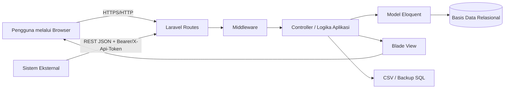
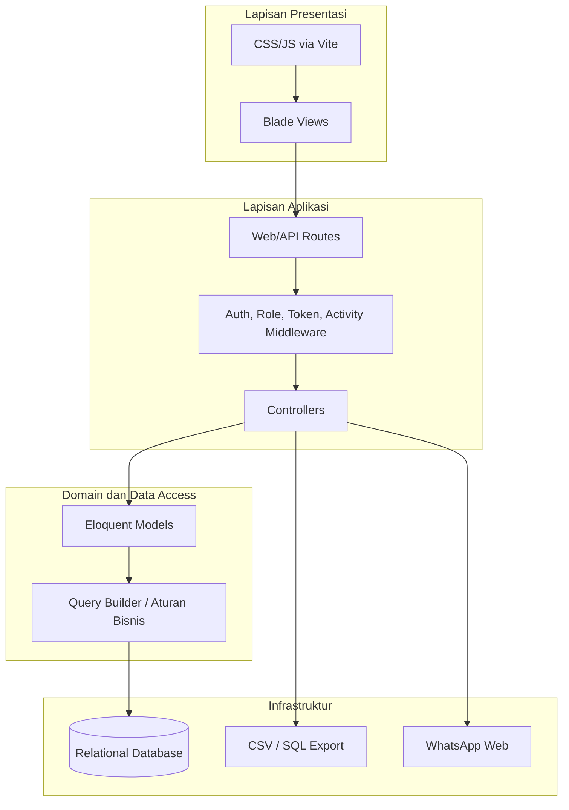
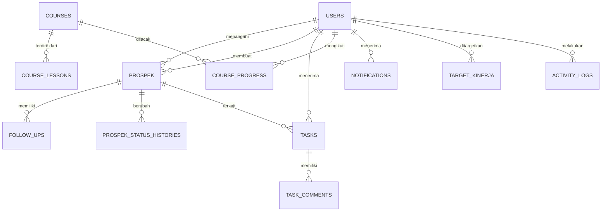
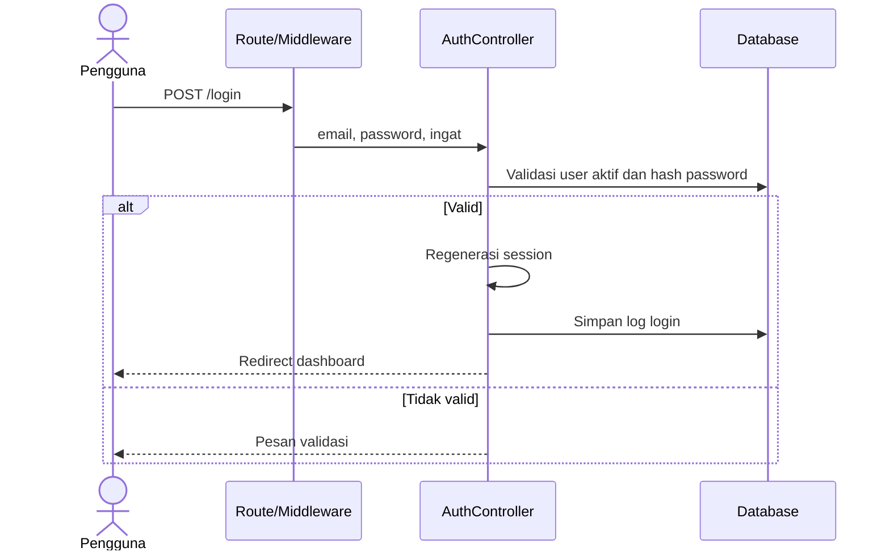
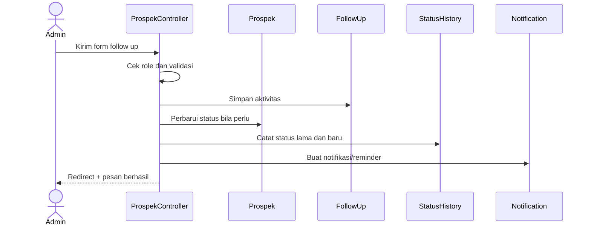
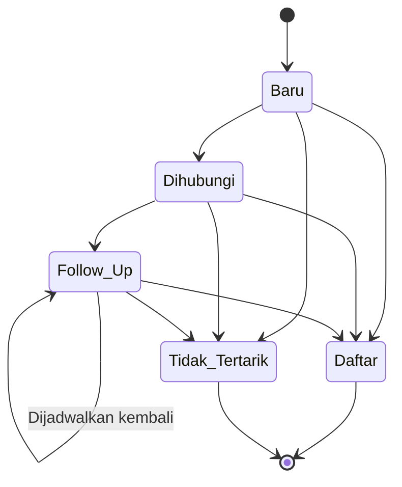
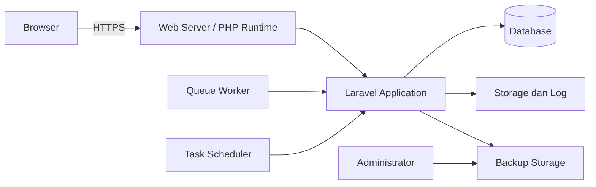

# ANALISIS KEBUTUHAN DAN PERANCANGAN PERANGKAT LUNAK

## SISTEM INFORMASI LEADS (CUSTOMER RELATIONSHIP MANAGEMENT)

**Dokumen Software Requirements Specification (SRS) dan Software Design Description (SDD)**  
**Versi dokumen:** 1.0  
**Tanggal:** 18 Juli 2026  
**Status:** Baseline dokumentasi implementasi  
**Penyusun:** [Nama Mahasiswa/Tim]  
**Institusi:** [Nama Institusi]  

---

## Lembar Pengesahan

| Peran | Nama | Tanggal | Tanda Tangan |
| --- | --- | --- | --- |
| Penyusun | [Nama] | [Tanggal] | [Tanda tangan] |
| Pembimbing/Penelaah | [Nama] | [Tanggal] | [Tanda tangan] |
| Pemilik Produk | [Nama] | [Tanggal] | [Tanda tangan] |

## Riwayat Revisi

| Versi | Tanggal | Uraian | Penyusun |
| --- | --- | --- | --- |
| 1.0 | 18 Juli 2026 | Penyusunan awal SRS dan SDD berdasarkan source code project | [Nama] |

## Abstrak

Sistem Informasi Leads merupakan aplikasi Customer Relationship Management (CRM) berbasis web untuk mendukung pengelolaan calon pelanggan pada beberapa cabang lembaga pendidikan. Sistem mencakup pencatatan dan impor leads, distribusi penanggung jawab, tindak lanjut, perubahan status hingga pendaftaran, dashboard indikator kinerja, laporan, target kinerja, tugas, pembelajaran, notifikasi, audit aktivitas, master data, dan integrasi API. Makalah ini mendokumentasikan kebutuhan serta desain perangkat lunak dengan struktur yang diselaraskan dengan ISO/IEC/IEEE 29148 untuk Software Requirements Specification dan IEEE 1016 untuk Software Design Description. Analisis dilakukan melalui penelusuran route, controller, model, migration, view, middleware, konfigurasi, dan pengujian otomatis pada project Laravel. Hasilnya adalah spesifikasi kebutuhan yang memiliki identitas, rancangan arsitektur berlapis, model data, desain antarmuka dan keamanan, serta matriks keterlacakan antara kebutuhan, komponen, dan pengujian. Dokumen ini dapat menjadi baseline untuk pengembangan, verifikasi, audit, dan pemeliharaan sistem.

**Kata kunci:** CRM, leads, Laravel, SRS, SDD, IEEE, rekayasa perangkat lunak.

## Daftar Isi

1. Pendahuluan
2. Gambaran Umum Sistem
3. Software Requirements Specification (SRS)
4. Software Design Description (SDD)
5. Verifikasi dan Validasi
6. Kesimpulan dan Rekomendasi
7. Daftar Pustaka
8. Lampiran

---

# 1. Pendahuluan

## 1.1 Latar Belakang

Pengelolaan leads yang tersebar pada lembar kerja, percakapan pribadi, atau catatan manual menimbulkan risiko duplikasi, kehilangan riwayat komunikasi, ketidakjelasan penanggung jawab, dan keterlambatan tindak lanjut. Organisasi dengan beberapa cabang juga memerlukan data yang konsisten agar manajemen dapat membandingkan jumlah leads, closing, sumber, program, serta kinerja pengguna dalam periode tertentu.

Sistem Informasi Leads dibangun untuk menyediakan satu sumber data operasional. Aplikasi menghubungkan proses akuisisi calon pelanggan, follow up, pendaftaran siswa, pelaporan, dan pengawasan kinerja dalam satu aplikasi web dengan kontrol akses berbasis peran.

## 1.2 Rumusan Masalah

1. Bagaimana menyimpan leads secara terpusat dan mencegah duplikasi nomor WhatsApp?
2. Bagaimana mengatur akses data berdasarkan peran, cabang, dan kepemilikan leads?
3. Bagaimana merekam follow up dan histori perubahan status secara dapat ditelusuri?
4. Bagaimana menyajikan KPI leads dan closing untuk kebutuhan operasional dan manajemen?
5. Bagaimana merancang sistem agar dapat dipelihara, diuji, diaudit, dan diintegrasikan?

## 1.3 Tujuan

Dokumen ini bertujuan untuk:

1. menetapkan kebutuhan fungsional dan nonfungsional sistem secara jelas dan dapat diuji;
2. mendeskripsikan arsitektur, komponen, basis data, antarmuka, dan keputusan desain;
3. menyediakan keterlacakan dari kebutuhan menuju implementasi dan pengujian;
4. menjadi acuan pengembangan, penerimaan, deployment, dan pemeliharaan.

## 1.4 Ruang Lingkup

Ruang lingkup sistem meliputi autentikasi, profil pengguna, dashboard KPI, leads, impor/ekspor CSV, follow up, data siswa/closing, laporan pribadi, tugas antar-admin, materi pembelajaran, notifikasi, log aktivitas, master data, target kinerja, template WhatsApp, backup SQL, dan API baca untuk integrasi. Pengiriman pesan WhatsApp berlangsung melalui tautan ke WhatsApp Web; sistem tidak mengirim pesan langsung melalui WhatsApp Business API.

## 1.5 Metode Penyusunan

Spesifikasi disusun dengan metode reverse engineering terhadap artefak project: `routes`, middleware, controller, model Eloquent, migration, Blade view, konfigurasi lingkungan, seeder, dan feature test. Oleh karena itu, kebutuhan pada dokumen ini merepresentasikan perilaku implementasi saat dokumen dibuat, sedangkan rekomendasi pengembangan diberi label tersendiri.

## 1.6 Acuan Standar

Struktur kebutuhan diselaraskan dengan ISO/IEC/IEEE 29148:2018. Desain perangkat lunak diselaraskan dengan IEEE 1016-2009. Istilah verifikasi dan kualitas mengacu pada praktik ISO/IEC 25010 dan pengujian perangkat lunak.

## 1.7 Istilah dan Singkatan

| Istilah | Definisi |
| --- | --- |
| CRM | Customer Relationship Management |
| Lead/Leads | Calon pelanggan; pada model data diberi nama `prospek` |
| Closing/Daftar | Lead yang berhasil mendaftar |
| Follow up | Aktivitas tindak lanjut terhadap lead |
| CSO/Staff | Pengguna operasional yang menangani lead miliknya |
| KPI | Key Performance Indicator |
| RBAC | Role-Based Access Control |
| SRS | Software Requirements Specification |
| SDD | Software Design Description |
| API | Application Programming Interface |

---

# 2. Gambaran Umum Sistem

## 2.1 Perspektif Produk

Aplikasi merupakan sistem web monolitik berarsitektur Model-View-Controller (MVC). Browser mengirim request HTTP ke route Laravel. Middleware menangani autentikasi, otorisasi peran, token integrasi, dan pencatatan aktivitas. Controller menjalankan validasi dan proses bisnis, model Eloquent mengakses basis data relasional, sedangkan Blade dan Tailwind CSS membentuk antarmuka pengguna.



## 2.2 Pemangku Kepentingan

| Pemangku kepentingan | Kepentingan utama |
| --- | --- |
| Superadmin | Pengguna, role, master data, target, materi, backup, audit |
| Admin | Operasi leads per cabang, follow up, closing, tugas, dan dashboard |
| Staff | Input dan pengelolaan lead milik sendiri, laporan pribadi, pembelajaran |
| Direksi | Pemantauan lintas cabang, dashboard, laporan, dan audit |
| Tim TI | Deployment, keamanan, integrasi, backup, pemeliharaan |
| Sistem eksternal | Membaca data prospek dan follow up melalui API bertoken |

## 2.3 Lingkungan Operasi

| Lapisan | Teknologi implementasi |
| --- | --- |
| Runtime backend | PHP `^8.3` |
| Framework | Laravel `^13.8` |
| Frontend | Blade, Tailwind CSS `^4`, JavaScript, Vite `^8` |
| Basis data | SQLite sebagai default; konfigurasi mendukung MySQL/MariaDB, PostgreSQL, dan SQL Server |
| Session/cache/queue default | Database |
| Pengujian | PHPUnit `^12.5.12`, Laravel Feature Test |
| Client | Browser modern dengan dukungan HTML5, CSS, dan JavaScript |

## 2.4 Batasan dan Asumsi

1. Sistem membutuhkan akun aktif untuk seluruh halaman web selain login.
2. Token `LEADS_API_TOKEN` wajib dikonfigurasi untuk API integrasi.
3. Nomor WhatsApp menjadi identitas unik lead pada tingkat basis data.
4. Nama cabang, sumber, dan program pada tabel prospek masih berupa relasi logis berbasis teks, bukan seluruhnya foreign key.
5. Hak akses final ditentukan oleh kombinasi route, middleware, controller, dan method pada model `User`.
6. Backup yang disediakan aplikasi berupa ekspor SQL; proses restore dilakukan secara administratif.

---

# 3. Software Requirements Specification (SRS)

## 3.1 Karakteristik Kebutuhan

Setiap kebutuhan diberi ID unik. Kata **harus** menyatakan kebutuhan wajib. Kriteria penerimaan digunakan untuk membuktikan bahwa kebutuhan dapat diverifikasi.

## 3.2 Kebutuhan Antarmuka Eksternal

### 3.2.1 Antarmuka Pengguna

UI-01. Sistem harus menyediakan halaman login, dashboard, daftar/detail/form prospek, follow up, data siswa, profil, tim, tugas, laporan, pembelajaran, notifikasi, log aktivitas, pengguna, dan pengaturan sesuai hak akses.

UI-02. Form harus menampilkan pesan validasi apabila data wajib tidak ada, format tidak sah, atau melanggar aturan bisnis.

UI-03. Daftar data harus mendukung pagination dan filter yang relevan. Dashboard harus mendukung filter periode serta konteks role.

UI-04. Nomor WhatsApp harus disamarkan pada pengguna yang bukan penanggung jawab lead; tautan WhatsApp Web hanya tersedia jika nomor dapat digunakan.

### 3.2.2 Antarmuka Perangkat Lunak

| ID | Antarmuka | Spesifikasi |
| --- | --- | --- |
| API-01 | `GET /api/integrations/prospek` | Mengembalikan JSON prospek terurut dan terpaginasikan |
| API-02 | `GET /api/integrations/follow-ups` | Mengembalikan JSON follow up beserta ringkasan prospek dan user |
| API-03 | Autentikasi API | Bearer token atau header `X-Api-Token`; dibandingkan dengan `LEADS_API_TOKEN` |
| API-04 | Pagination | Parameter `per_page`, minimum 1, default 100, maksimum 500 |
| FILE-01 | Import | CSV dengan kolom yang dipetakan ke data prospek |
| FILE-02 | Export | CSV UTF-8 dengan BOM untuk kompatibilitas aplikasi spreadsheet |
| FILE-03 | Backup | Stream download file SQL oleh superadmin |

### 3.2.3 Antarmuka Komunikasi

Sistem menggunakan HTTP pada pengembangan dan harus menggunakan HTTPS pada produksi. Integrasi WhatsApp menggunakan URL `https://web.whatsapp.com/send` dengan nomor yang dinormalisasi ke kode negara `62` dan pesan opsional dari template.

## 3.3 Kebutuhan Fungsional

### 3.3.1 Autentikasi dan Akun

| ID | Kebutuhan | Kriteria penerimaan |
| --- | --- | --- |
| FR-AUTH-01 | Sistem harus mengautentikasi pengguna dengan email dan password. | Kredensial benar dan akun aktif menghasilkan session serta redirect ke dashboard. |
| FR-AUTH-02 | Sistem harus menolak akun tidak aktif atau kredensial salah. | Login gagal dan pesan kesalahan ditampilkan tanpa membuat session autentik. |
| FR-AUTH-03 | Sistem harus meregenerasi session setelah login. | ID session berubah setelah autentikasi berhasil. |
| FR-AUTH-04 | Sistem harus mengakhiri session dan meregenerasi token CSRF saat logout. | Halaman terproteksi tidak dapat diakses setelah logout. |
| FR-AUTH-05 | Pengguna harus dapat memperbarui profil dan media sosial; perubahan password mensyaratkan password lama. | Data tersimpan dan hash password baru dapat digunakan saat login. |

### 3.3.2 Dashboard dan Pelaporan

| ID | Kebutuhan | Kriteria penerimaan |
| --- | --- | --- |
| FR-DASH-01 | Sistem harus menyajikan total lead aktif, lead baru, follow up, closing, conversion rate, CSO aktif, dan jumlah asal sekolah. | Nilai sesuai agregasi basis data pada periode terpilih. |
| FR-DASH-02 | Sistem harus menyajikan agregasi berdasarkan sumber, program, sekolah, cabang, dan pertumbuhan waktu. | Grafik/tabel berubah sesuai filter. |
| FR-DASH-03 | Sistem harus menampilkan target dan realisasi kinerja serta ranking sesuai konteks role. | Nilai target berasal dari `target_kinerja` dan realisasi dari prospek. |
| FR-DASH-04 | Sistem harus membatasi konteks dashboard berdasarkan role dan menyediakan filter yang diizinkan. | Staff melihat konteks pribadi; role dengan akses lintas cabang dapat membandingkan cabang. |
| FR-REP-01 | Sistem harus menyajikan laporan leads dan closing milik pengguna yang login. | Data pengguna lain tidak muncul pada laporan pribadi. |
| FR-REP-02 | Sistem harus mengekspor laporan pribadi ke CSV. | CSV berisi lead milik pengguna dan kolom closing/pembayaran terkait. |

### 3.3.3 Manajemen Leads

| ID | Kebutuhan | Kriteria penerimaan |
| --- | --- | --- |
| FR-LEAD-01 | Admin dan staff harus dapat menambah lead melalui form. | Lead valid tersimpan; `created_by` merekam pengguna pembuat. |
| FR-LEAD-02 | Sistem harus memvalidasi keunikan nomor WhatsApp. | Nomor duplikat ditolak oleh validasi dan constraint unik. |
| FR-LEAD-03 | Sistem harus mendukung status `Baru`, `Dihubungi`, `Follow Up`, `Daftar`, dan `Tidak Tertarik`. | Status selain enumerasi tersebut ditolak. |
| FR-LEAD-04 | Sistem harus mendukung pencarian, filter, pagination, detail, edit, dan penghapusan sesuai otorisasi. | Hasil query dan aksi sesuai role/kepemilikan/cabang. |
| FR-LEAD-05 | Staff hanya boleh mengubah lead yang menjadi tanggung jawabnya. | Update lead lain menghasilkan 403. |
| FR-LEAD-06 | Admin boleh mengubah dan menghapus lead pada ruang akses operasionalnya. | Aksi valid berhasil dan perubahan tersimpan. |
| FR-LEAD-07 | Sistem harus mendukung aksi massal untuk data terpilih sesuai hak akses. | Hanya ID yang lolos otorisasi yang diproses. |
| FR-LEAD-08 | Sistem harus mengimpor lead dari CSV dan menyediakan contoh file import. | Baris valid tersimpan, baris invalid/duplikat dilaporkan. |
| FR-LEAD-09 | Sistem harus mengekspor daftar lead yang dapat diakses pengguna ke CSV. | File terunduh dan scope datanya sesuai otorisasi. |
| FR-LEAD-10 | Sistem harus menyimpan sekolah baru yang ditemukan saat input/import bila diperlukan. | Master sekolah dapat digunakan kembali pada input berikutnya. |
| FR-LEAD-11 | Nomor WhatsApp yang dilihat bukan pemilik harus disamarkan dua digit terakhir. | Nomor tampil berakhiran `xx`; link WhatsApp tidak dibuat. |

### 3.3.4 Follow Up dan Closing

| ID | Kebutuhan | Kriteria penerimaan |
| --- | --- | --- |
| FR-FU-01 | Admin harus dapat mencatat waktu, metode, hasil, catatan, tindak lanjut, jadwal berikutnya, dan prioritas follow up. | Record `follow_ups` tersimpan dan terhubung ke prospek/user. |
| FR-FU-02 | Metode follow up harus dibatasi pada WhatsApp, Telepon, Kunjungan, Email, atau Lainnya. | Nilai lain ditolak validasi. |
| FR-FU-03 | Sistem harus mengubah status prospek sesuai hasil follow up dan merekam histori status. | `prospek.status` dan `prospek_status_histories` konsisten. |
| FR-FU-04 | Sistem harus mengklasifikasikan jadwal sebagai Terjadwal, Hari ini, Overdue, atau Belum dijadwalkan. | Label sesuai tanggal dan status hasil follow up. |
| FR-FU-05 | Sistem harus membuat reminder/notifikasi follow up yang relevan. | Pengguna yang berhak melihat reminder pada modul follow up/notifikasi. |
| FR-CLOSE-01 | Lead berstatus `Daftar` harus dapat menyimpan tanggal daftar, program final, nominal dan status pembayaran, kelas angkatan, serta catatan administrasi. | Data tampil pada modul data siswa dan export. |

### 3.3.5 Modul Pendukung

| ID | Kebutuhan | Kriteria penerimaan |
| --- | --- | --- |
| FR-TASK-01 | Admin harus dapat membuat, memperbarui, menghapus, dan mengomentari tugas antar-admin. | Staff ditolak; penerima harus admin aktif pada scope cabang yang sesuai. |
| FR-TASK-02 | Tugas dapat dihubungkan dengan prospek dan memiliki status, prioritas, tenggat, pembuat, penerima, serta cabang. | Relasi dan atribut tersimpan. |
| FR-COURSE-01 | Pengguna harus dapat melihat course aktif dan memperbarui progress 0–100%. | Status menjadi Belum Mulai, Berjalan, atau Selesai sesuai persentase. |
| FR-COURSE-02 | Superadmin harus dapat mengelola course dan submateri. | CRUD tersedia; pengguna biasa hanya melihat item aktif. |
| FR-NOTIF-01 | Sistem harus mengirim dan menampilkan notifikasi personal atau broadcast. | Penerima dapat melihat notifikasi yang ditujukan kepadanya atau broadcast. |
| FR-NOTIF-02 | Pengguna harus dapat menandai satu atau seluruh notifikasi sebagai dibaca. | `dibaca_pada` terisi tanpa mengubah notifikasi milik pengguna lain. |

### 3.3.6 Administrasi dan Audit

| ID | Kebutuhan | Kriteria penerimaan |
| --- | --- | --- |
| FR-ADM-01 | Superadmin harus dapat mengelola pengguna, role, cabang, status aktif, dan media sosial. | Perubahan tersimpan dan langsung memengaruhi akses. |
| FR-ADM-02 | Superadmin harus dapat mengelola master cabang, sumber lead, program, sekolah, template WhatsApp, dan target kinerja. | Operasi CRUD mematuhi validasi dan keunikan master. |
| FR-AUD-01 | Sistem harus mencatat login, logout, dan request perubahan data (`POST`, `PUT`, `PATCH`, `DELETE`). | Log memuat pengguna, aksi, route/objek yang relevan, IP, user agent, dan waktu bila tersedia. |
| FR-AUD-02 | Superadmin dan direksi harus dapat melihat log aktivitas. | Role lain menerima 403 pada route log aktivitas. |
| FR-BACKUP-01 | Superadmin harus dapat mengekspor backup SQL. | Browser mengunduh file SQL yang berisi tabel dalam cakupan backup. |

### 3.3.7 Integrasi

| ID | Kebutuhan | Kriteria penerimaan |
| --- | --- | --- |
| FR-API-01 | Sistem harus menolak API integrasi tanpa token yang cocok. | Response HTTP 401 dikembalikan. |
| FR-API-02 | API prospek harus mengembalikan data terpaginasikan dalam JSON. | Response memuat `data` dan metadata pagination. |
| FR-API-03 | API follow up harus mengembalikan data follow up serta identitas ringkas prospek dan user. | Field sesuai kontrak endpoint. |
| FR-API-04 | Nilai `per_page` harus dibatasi antara 1 dan 500. | Nilai di luar batas dinormalisasi ke batas terdekat. |

## 3.4 Aturan Bisnis

| ID | Aturan |
| --- | --- |
| BR-01 | Satu nomor WhatsApp hanya boleh dimiliki oleh satu prospek. |
| BR-02 | Akun harus berstatus aktif untuk dapat login. |
| BR-03 | Staff mengubah lead miliknya; admin mengelola operasi lead dan follow up; direksi bersifat pemantauan; superadmin mengelola konfigurasi sistem. |
| BR-04 | Penanggung jawab lead/tugas yang terikat cabang harus konsisten dengan cabang data. |
| BR-05 | Hasil `Closing` memetakan prospek ke `Daftar`, sedangkan `Tidak tertarik` memetakan ke `Tidak Tertarik`. |
| BR-06 | Follow up yang sudah Closing atau Tidak tertarik tidak dihitung sebagai jadwal aktif. |
| BR-07 | Progress 100% berstatus Selesai dan mengisi `completed_at`. |
| BR-08 | Target kinerja dapat bertipe cabang atau pengguna pada bulan dan tahun tertentu. |

## 3.5 Matriks Hak Akses Konseptual

| Fungsi | Superadmin | Admin | Staff | Direksi |
| --- | :---: | :---: | :---: | :---: |
| Login dan profil | Ya | Ya | Ya | Ya |
| Dashboard | Lintas cabang | Data cabang/filter staff | Personal | Lintas cabang |
| Lihat lead | Ya | Ya | Ya | Ya, baca saja |
| Input lead | Tidak | Ya | Ya | Tidak |
| Edit lead | Tidak | Cabang/ruang operasional | Milik sendiri | Tidak |
| Hapus lead | Tidak | Ya | Tidak | Tidak |
| Catat follow up | Tidak | Ya | Tidak | Tidak |
| Tugas antar-admin | Pantau lintas cabang | Kelola | Tidak | Pantau lintas cabang |
| Kelola pembelajaran | Ya | Tidak | Tidak | Tidak |
| Progress pembelajaran | Course aktif | Course aktif | Course aktif | Course aktif |
| Master, pengguna, target, backup | Ya | Tidak | Tidak | Tidak |
| Log aktivitas | Ya | Tidak | Tidak | Ya |

Catatan: tabel ini mengikuti method otorisasi pada implementasi saat ini. Semua perubahan kebijakan role harus diikuti perubahan test dan matriks keterlacakan.

## 3.6 Kebutuhan Nonfungsional

| ID | Kategori | Kebutuhan terukur |
| --- | --- | --- |
| NFR-SEC-01 | Kerahasiaan | Seluruh trafik produksi harus menggunakan HTTPS; cookie session harus disetel aman sesuai deployment. |
| NFR-SEC-02 | Autentikasi | Password harus disimpan dengan hashing Laravel; password dan remember token tidak boleh muncul pada serialisasi model. |
| NFR-SEC-03 | Otorisasi | Setiap operasi tulis harus memeriksa role dan scope data pada server, bukan hanya menyembunyikan tombol UI. |
| NFR-SEC-04 | Input | Seluruh input harus divalidasi; query harus menggunakan query builder/Eloquent atau binding parameter. |
| NFR-SEC-05 | API | Token integrasi tidak boleh disimpan dalam source control/log dan harus dapat dirotasi melalui environment. |
| NFR-SEC-06 | Privasi | Nomor WhatsApp harus disamarkan untuk pengguna yang tidak berhak dan backup/export harus diperlakukan sebagai data sensitif. |
| NFR-PERF-01 | Waktu respons | Pada beban operasional normal, 95% halaman non-export ditargetkan selesai maksimal 3 detik di infrastruktur produksi yang disetujui. |
| NFR-PERF-02 | Pagination | Daftar UI dan API harus menggunakan pagination; API maksimal 500 record per halaman. |
| NFR-REL-01 | Integritas | Operasi yang memperbarui prospek, follow up, dan histori status harus atomik menggunakan transaksi basis data. |
| NFR-REL-02 | Pemulihan | Backup harus diuji restore secara berkala; target RPO 24 jam dan RTO 4 jam perlu disahkan pemilik sistem. |
| NFR-USAB-01 | Kemudahan pakai | Label, pesan, tanggal, mata uang, dan status pada UI menggunakan Bahasa Indonesia yang konsisten. |
| NFR-COMP-01 | Portabilitas | Aplikasi harus dapat dijalankan pada PHP 8.3+ dan basis data yang didukung konfigurasi Laravel, dengan pengujian dialek sebelum produksi. |
| NFR-MAINT-01 | Pemeliharaan | Logika domain harus ditempatkan pada class yang dapat diuji; controller berukuran besar perlu direfaktor bertahap ke service/query object. |
| NFR-TEST-01 | Pengujian | Seluruh kebutuhan kritis autentikasi, otorisasi, leads, follow up, dashboard, export, target, tugas, dan API harus memiliki automated test. |
| NFR-AUD-01 | Audit | Perubahan data harus dapat ditelusuri ke pengguna, waktu, aksi, alamat IP, dan user agent sejauh tersedia. |

## 3.7 Kriteria Penerimaan Sistem

Sistem dapat diterima apabila seluruh test kritis lulus, migration dapat dijalankan pada database target, tidak terdapat kerentanan kritis/tinggi yang belum dimitigasi, backup dapat direstore pada lingkungan uji, seluruh role lolos uji akses, data KPI cocok dengan sampel perhitungan manual, dan pemilik produk menyetujui User Acceptance Test (UAT).

---

# 4. Software Design Description (SDD)

## 4.1 Tujuan dan Sudut Pandang Desain

SDD mendeskripsikan desain melalui sudut pandang konteks, dekomposisi, ketergantungan, data, antarmuka, interaksi, keamanan, dan deployment. Desain yang dijelaskan adalah desain aktual project, disertai peningkatan yang direkomendasikan.

## 4.2 Arsitektur Logis



Pola utama adalah MVC dengan server-side rendering. Keuntungan desain ini adalah deployment sederhana dan konsistensi validasi pada server. Konsekuensinya, controller `ProspekController` dan `ModulController` memuat banyak tanggung jawab sehingga berisiko sulit dipelihara jika fitur terus bertambah.

## 4.3 Dekomposisi Komponen

| Komponen | Tanggung jawab | Kebutuhan terkait |
| --- | --- | --- |
| `AuthController` | Login, logout, session, log autentikasi | FR-AUTH-01–04 |
| `ProfilController` | Profil, media sosial, password | FR-AUTH-05 |
| `ProspekController` | Dashboard, leads, follow up, siswa, import/export | FR-DASH, FR-LEAD, FR-FU, FR-CLOSE |
| `ModulController` | Tim, tugas, laporan, pembelajaran, notifikasi | FR-REP, FR-TASK, FR-COURSE, FR-NOTIF |
| `PengaturanController` | Master, role, target, template, backup | FR-ADM, FR-BACKUP |
| `PenggunaController` | Administrasi akun alternatif | FR-ADM-01 |
| `ActivityLogController` | Penelusuran log | FR-AUD-02 |
| `IntegrationController` | API prospek dan follow up | FR-API-01–04 |
| `PastikanRole` | Pembatasan route berdasarkan role | NFR-SEC-03 |
| `VerifyIntegrationToken` | Validasi token API | NFR-SEC-05 |
| `CatatAktivitas` | Audit request perubahan | FR-AUD-01 |
| Model Eloquent | Mapping tabel, relasi, cast, aturan domain | BR-01–08 |

## 4.4 Desain Data

### 4.4.1 Model Konseptual



### 4.4.2 Kamus Data Inti

| Entitas | Kunci dan atribut penting | Aturan integritas |
| --- | --- | --- |
| `users` | `id`, `email`, `password`, `role`, `cabang`, `aktif` | Email unik; role mengendalikan akses |
| `prospek` | `id`, `nama`, `no_wa`, `status`, `cabang`, `user_id`, `created_by` | `no_wa` unik; FK user nullable |
| `follow_ups` | `prospek_id`, `user_id`, waktu, metode, hasil, jadwal | Prospek terhapus menghapus riwayat terkait sesuai migration |
| `prospek_status_histories` | prospek, user, status lama/baru, sumber | Menjadi audit perubahan status bisnis |
| `tasks` | judul, status, prioritas, tenggat, prospek, penerima, pembuat | Penerima harus admin aktif sesuai aturan aplikasi |
| `courses`/`course_lessons` | judul, konten, level, urutan, aktif | Lesson bergantung pada course |
| `course_progress` | course, lesson nullable, user, status, persen | Kombinasi konteks progress harus konsisten |
| `target_kinerja` | bulan, tahun, tipe, cabang/user, target | Target mengikuti konteks cabang atau user |
| `notifications` | user nullable, tipe, judul, pesan, `dibaca_pada` | User null berarti broadcast |
| `activity_logs` | user, aksi, metode, URL, IP, user agent, payload terkait | Digunakan untuk audit |

Skema fisik lengkap dan kardinalitas rinci tersedia pada [dokumentasi.md](dokumentasi.md) serta file [dokumentasi-erd.drawio](dokumentasi-erd.drawio).

## 4.5 Desain Interaksi Utama

### 4.5.1 Login



### 4.5.2 Pencatatan Follow Up



Implementasi ideal membungkus penyimpanan `FollowUp`, perubahan `Prospek`, dan `StatusHistory` dalam satu transaksi agar memenuhi NFR-REL-01.

## 4.6 Desain Status



## 4.7 Desain Antarmuka API

### 4.7.1 Kontrak Request

```http
GET /api/integrations/prospek?per_page=100 HTTP/1.1
Authorization: Bearer {LEADS_API_TOKEN}
Accept: application/json
```

Alternatif autentikasi menggunakan `X-Api-Token`. API hanya menyediakan operasi baca. Response mengikuti bentuk paginator Laravel, dengan koleksi pada `data` dan metadata halaman.

### 4.7.2 Respons Kesalahan

| Kondisi | HTTP | Makna |
| --- | ---: | --- |
| Token tidak ada/salah atau konfigurasi kosong | 401 | Tidak terautentikasi |
| Resource web tidak boleh diakses | 403 | Terautentikasi tetapi tidak berwenang |
| Resource tidak ditemukan/tidak aktif | 404 | Resource tidak tersedia |
| Validasi gagal | 422 | Input tidak memenuhi aturan |
| Kesalahan internal | 500 | Kegagalan server; detail tidak ditampilkan pada produksi |

## 4.8 Desain Keamanan

1. **Authentication:** session Laravel, password hashed, akun aktif, regenerasi session.
2. **Authorization:** middleware `auth`, middleware `role`, dan pemeriksaan scope pada controller/model.
3. **CSRF:** route web menggunakan perlindungan CSRF Laravel.
4. **Input/output:** request validation, Eloquent/query binding, dan escaping default Blade.
5. **API:** shared secret melalui environment dan perbandingan `hash_equals`.
6. **Audit:** login/logout dan operasi perubahan dicatat.
7. **Privasi:** dua digit nomor WhatsApp disamarkan bagi bukan pemilik.
8. **Produksi:** `APP_DEBUG=false`, HTTPS, secret rotation, permission storage minimum, backup terenkripsi, dan log terproteksi.

Mitigasi akses data telah diterapkan: daftar, export, dashboard operasional, reminder, dan halaman detail menggunakan scope yang konsisten. Superadmin dan direksi dapat membaca lintas cabang, admin dibatasi pada cabangnya, sedangkan staff dibatasi pada lead yang menjadi tanggung jawabnya. Akses detail oleh staff bukan pemilik dan admin lintas cabang diverifikasi melalui negative authorization test.

## 4.9 Desain Deployment



Tahap deployment minimum: konfigurasi `.env`, instalasi dependency production, generate `APP_KEY`, build aset, migration terkontrol, link storage bila diperlukan, cache konfigurasi/view, permission storage, web server HTTPS, worker/scheduler bila digunakan, health check `/up`, dan smoke test role.

## 4.10 Keputusan dan Risiko Desain

| Keputusan/risiko | Dampak | Mitigasi |
| --- | --- | --- |
| Monolitik MVC | Deployment sederhana, tetapi controller membesar | Ekstrak service, policy, form request, dan query object |
| Cabang/sumber/program berupa teks pada prospek | Mudah diimpor, rawan inkonsistensi master | Migrasi bertahap ke foreign key atau validasi referensial ketat |
| Shared token tunggal untuk API | Integrasi sederhana, audit client terbatas | Token per client, rotasi, expiry, scope, dan rate limiting |
| Backup dapat diunduh dari aplikasi | Operasional mudah, data sensitif terekspos bila akun bocor | MFA superadmin, enkripsi, audit download, retensi |
| Export CSV sinkron | Sederhana, dapat lambat pada data besar | Queue/background export dan batas periode |
| Dashboard memiliki query agregasi kompleks | Informasi kaya, risiko response lambat | Index, caching, query profiling, materialized summary bila diperlukan |

---

# 5. Verifikasi dan Validasi

## 5.1 Strategi Pengujian

| Tingkat | Fokus | Teknik |
| --- | --- | --- |
| Unit | Method status, masking, normalisasi, aturan domain | PHPUnit dengan input batas |
| Feature | Route, autentikasi, role, validasi, database, export | Laravel HTTP test + RefreshDatabase |
| Integration | API, database target, import/export, backup/restore | Test environment yang menyerupai produksi |
| Security | IDOR, CSRF, session, token, injection, file import | Negative test dan security review |
| Performance | Dashboard, pagination, export | Load test dengan volume data representatif |
| UAT | Alur bisnis dari lead hingga closing | Skenario oleh admin, staff, direksi, superadmin |

## 5.2 Skenario UAT Utama

| ID | Skenario | Hasil yang diharapkan |
| --- | --- | --- |
| UAT-01 | Login akun aktif dan tidak aktif | Akun aktif masuk; akun tidak aktif ditolak |
| UAT-02 | Staff membuat dan mengubah lead milik sendiri | Data tersimpan; scope kepemilikan konsisten |
| UAT-03 | Staff mencoba mengubah lead lain | Sistem menolak dengan 403 |
| UAT-04 | Admin mencatat follow up Closing | Follow up, status Daftar, dan histori tersimpan |
| UAT-05 | Import CSV berisi nomor duplikat | Duplikat tidak membuat record kedua dan dilaporkan |
| UAT-06 | Dashboard difilter periode/cabang | KPI sesuai data sampel manual |
| UAT-07 | Superadmin mengubah master dan target | Data baru digunakan pada form/dashboard |
| UAT-08 | Staff mencoba mengelola tugas | Sistem menolak; admin dapat mengelola tugas antar-admin |
| UAT-09 | API tanpa dan dengan token | Tanpa token 401; dengan token JSON terpaginasikan |
| UAT-10 | Restore backup pada database uji | Data dan relasi dapat dipulihkan serta aplikasi dapat login |

## 5.3 Matriks Keterlacakan

| Kebutuhan | Komponen utama | Bukti verifikasi |
| --- | --- | --- |
| FR-AUTH-01–05 | `AuthController`, `ProfilController`, `User` | Feature test login/profil |
| FR-DASH-01–04 | `ProspekController::dashboard` | Test KPI, filter, role dashboard |
| FR-LEAD-01–11 | `ProspekController`, `Prospek` | Test CRUD, scope, import/export, masking |
| FR-FU-01–05 | `ProspekController`, `FollowUp`, `ProspekStatusHistory` | Test follow up, status, reminder |
| FR-CLOSE-01 | `Prospek`, view data siswa | Test closing dan export data siswa |
| FR-TASK-01–02 | `ModulController`, `Task`, `TaskComment` | Test tugas antar-admin dan forbidden staff |
| FR-COURSE-01–02 | `ModulController`, `Course*` | Test CRUD course dan progress |
| FR-NOTIF-01–02 | `SistemNotification`, `ModulController` | Test tampilan dan tandai dibaca |
| FR-ADM-01–02 | `PengaturanController`, master models | Test role, cabang, target, template |
| FR-AUD-01–02 | `CatatAktivitas`, `ActivityLogController` | Test event log dan akses role |
| FR-API-01–04 | `VerifyIntegrationToken`, `IntegrationController` | Test 401, payload, pagination batas |
| FR-BACKUP-01 | `PengaturanController::exportBackup` | Inspeksi SQL dan uji restore |

## 5.4 Definition of Done

Sebuah perubahan dianggap selesai apabila requirement dan acceptance criteria diperbarui, implementasi lolos lint/static check, automated test baru dan lama lulus, migration memiliki strategi rollback/backup, akses seluruh role diverifikasi, dokumentasi API/UI relevan diperbarui, dan reviewer menyetujui perubahan.

---

# 6. Kesimpulan dan Rekomendasi

Sistem Informasi Leads telah mencakup alur utama CRM pendidikan dari akuisisi lead hingga closing, beserta fungsi pemantauan dan administrasi. Implementasi memanfaatkan Laravel MVC, basis data relasional, RBAC, validasi server, audit aktivitas, integrasi API, dan pengujian fitur. Penyusunan SRS dan SDD membuat ruang lingkup, perilaku, tanggung jawab komponen, dan bukti pengujian lebih mudah ditelusuri.

Prioritas pengembangan berikutnya adalah:

1. menyatukan otorisasi pada Laravel Policy agar semua route memakai scope data yang konsisten;
2. memecah controller besar menjadi service, form request, dan query object;
3. membungkus proses follow up/status/notifikasi dalam transaksi;
4. menambah test negatif untuk akses detail, export, aksi massal, dan API;
5. menerapkan rate limiting serta token per client pada API;
6. menguji backup-restore dan target RPO/RTO secara berkala;
7. membuat baseline performa dashboard dengan data produksi tersamarkan;
8. menormalisasi relasi cabang, sumber, dan program bila kebutuhan integritas meningkat.

---

# 7. Daftar Pustaka

1. ISO/IEC/IEEE 29148:2018, *Systems and software engineering—Life cycle processes—Requirements engineering*.
2. IEEE Std 1016-2009, *IEEE Standard for Information Technology—Systems Design—Software Design Descriptions*.
3. ISO/IEC 25010:2011, *Systems and software Quality Requirements and Evaluation (SQuaRE)—System and software quality models*.
4. Laravel, *Laravel Documentation*, dokumentasi framework yang sesuai dengan versi project.
5. Project Sistem Informasi Leads, source code, migration, route, controller, model, view, dan test, diakses 18 Juli 2026.

---

# 8. Lampiran

## Lampiran A — Artefak Desain

- [Dokumentasi teknis lengkap](dokumentasi.md)
- [Panduan penggunaan](panduan-penggunaan.md)
- [ERD Draw.io](dokumentasi-erd.drawio)
- [DFD Draw.io](dokumentasi-dfd.drawio)
- [Use Case Draw.io](dokumentasi-usecase.drawio)
- [Alur Proses Draw.io](dokumentasi-alur-proses.drawio)
- [Kardinalitas Draw.io](dokumentasi-kardinalitas.drawio)

## Lampiran B — Identitas Requirement

Penambahan requirement baru harus memakai pola `FR-{MODUL}-{NN}` atau `NFR-{KATEGORI}-{NN}`, tidak menggunakan kembali ID yang telah dihapus, serta memperbarui acceptance criteria, komponen desain, test, dan matriks keterlacakan.

## Lampiran C — Pernyataan Baseline

Dokumen ini disusun berdasarkan kondisi source code pada 18 Juli 2026. Kolom identitas penyusun, institusi, pengesahan, target kinerja nonfungsional, serta kebijakan retensi/backup harus dikonfirmasi sebelum dokumen disahkan sebagai kontrak kebutuhan resmi.
